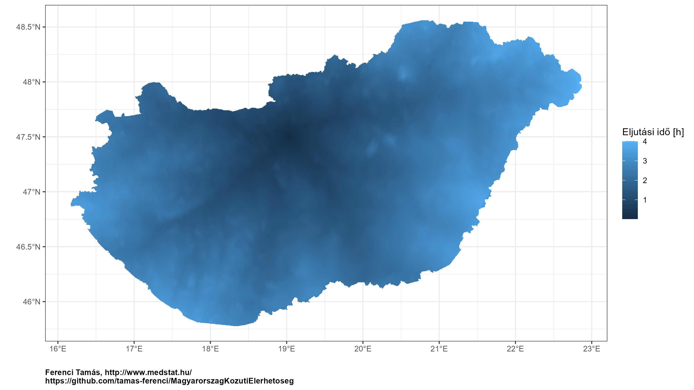
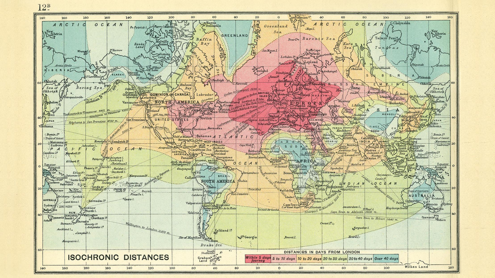
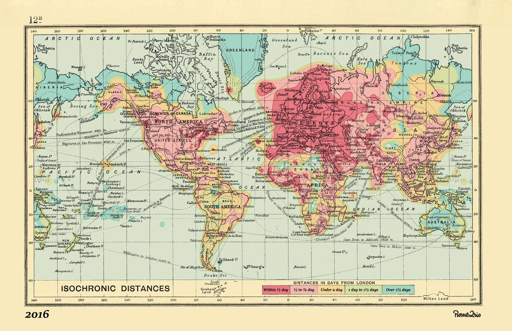
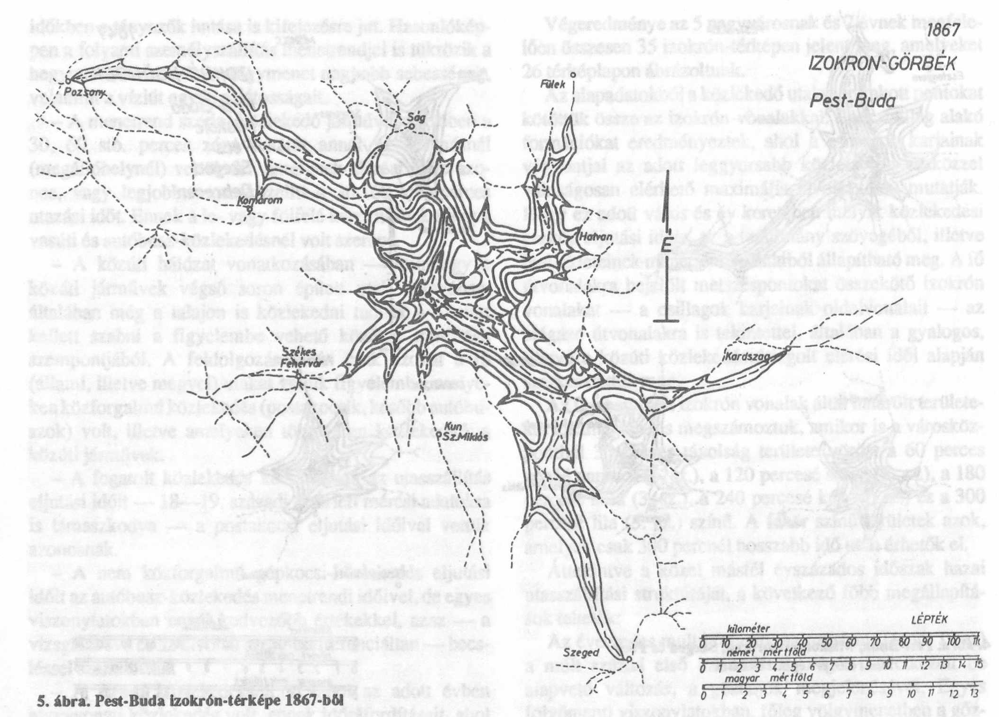
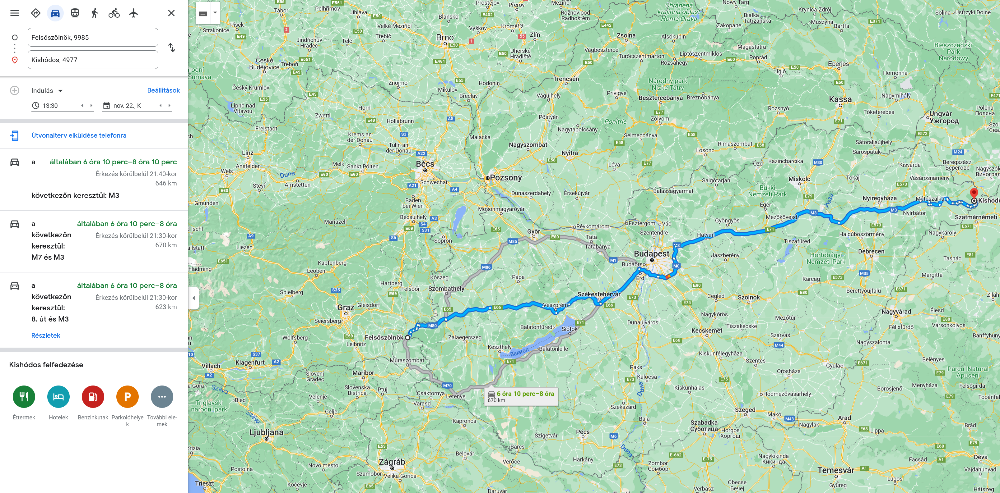
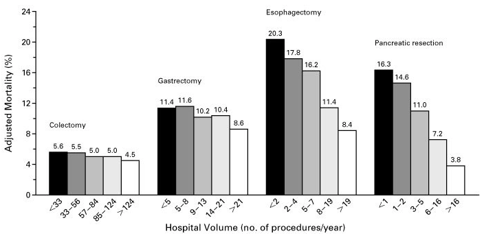

```{r setup, include=FALSE}
knitr::opts_chunk$set(echo = TRUE, fig.width = 16/3*2, fig.height = 9/3*2, dpi = 300, dev = "ragg_png")
library(data.table)
library(ggplot2)
theme_set(theme_bw())
theme_update(plot.caption = element_text(face = "bold", hjust = 0))
library(sf)
set.seed(1)
locs <- readRDS("locs.rds")
geodata <- readRDS("geodata.rds")
HNTdata <- readRDS("HNTdata.rds")
JarasInd <- (HNTdata$Helység.megnevezése==HNTdata$Járás.székhelye)|(HNTdata$Megye.megnevezése=="főváros")
captionlab <- paste0("Ferenci Tamás, http://www.medstat.hu/\nhttps://github.com/tamas-ferenci/",
                     "MagyarorszagKozutiElerhetoseg")
```

## Kérdésfelvetés

Sokan szinte nap mint nap használnak valamilyen útvonaltervező programot. Ilyenekkel pillanatok alatt megkereshetjük, hogy melyik a legrövidebb vagy leggyorsabb út két pont (legegyszerűbb esetben: két település) között, de ezt látva felvetődhet az emberben: akkor már miért nem bővítjük a vizsgálódásunk körét? Mi volna, ha _minden_ magyar település-pár között megkeresnénk a legrövidebb utat...? Nem is azért, hogy a navigációt javítsuk, arra tökéletesek ezek az alkalmazások, hanem azért, hogy a _rendszerről_, jelen esetben a magyar közúti rendszerről megtudjunk valamit! Hogyan épül fel? Mely települések érhetőek el gyorsabban, melyek lassabban? Adott településből hova lehet 1 órán belül eljutni? Igaz, hogy Budapest-centrikus az útvonalhálózat? Mennyire erős ez a hatás? Az ember eleresztheti jobban is a fantáziáját. Melyik két magyar település van a legtávolabb -- akár kilométerben, akár időben -- egymástól közúton? Mennyi a minimális út vagy idő, ami ahhoz szükséges, hogy az összes magyar települést autóval felkeressük? (És mi az optimális útvonal?) Melyik az a település, amire igaz, hogy a tőle vett távolságok átlaga a legkisebb, azaz, ahonnan az átlagosan legkönnyebb bárhová eljutni az országba? Na és amire igaz, hogy a tőle legtávolabbi település távolsága a legkisebb? (A dolog persze szimmetrikus: akkor ide a legkönnyebb eljutni bárhonnan. Hova érdemes kórházat telepíteni, ha azt szeretnénk, hogy a leggyorsabban elérhető legyen, átlagosan, vagy legrosszabb esetben is?)

Ezekre a kérdésekre fogok a jelen esszében megpróbálni válaszolni.

A problémakört szép nevén _közúti elérhetőségnek_ lehetne nevezni. Valójában nincs szó nagy újdonságról, sokaknak ismerős lehet a régi autóstérképekről a kis táblázat, mely a nagy városok között tüntette fel -- táblázat alakban elrendezve az összes lehetséges pár között -- a távolságot. Ugyanezt fogjuk most megtenni, csak kihasználva az informatika lehetőségeit sokkal alaposabban és átfogóbban, valamint a kapott eredményeknek többféle alkalmazását is ki fogjuk próbálni.



## Módszertan

Több útvonaltervező alkalmazás van széles körű használatban, azonban nem mindegyik támogatja (pláne könnyen) a nagyon sok település-pár közötti tömeges lekérdezést, amire most szükségünk volna. Nem csak arról van szó, hogy ez technikailag hogy oldható meg, hanem arról is, hogy ha interneten kell a kéréseket átküldeni, az könnyen lehet, hogy nagyon lassú lesz. Mindezekre tekintettel a választásom az [OpenStreetMap](https://www.openstreetmap.org/) rendszerre esett. Ez több fontos előnnyel is bír:

- Ingyenes és nagyon szabad licensszel bír. 
- Az egész ország térképe letölthető (erre a célra a [Geofabrik](https://download.geofabrik.de/) oldalát használtam), így minden számítás elvégezhető off-line, a helyi számítógépen, internet szüksége nélkül.
- Elérhető hozzá olyan program, amely nagyon jó tulajdonságú és gyors útvonaltervezést végez a térkép alapján, ez az [OSRM](http://project-osrm.org/) (Open Source Routing Machine), ami ráadásul ingyenesen és nyílt forráskódú.

A fenti rendszer felállításának és az útvonaltervezés végrehajtásának a technikai részleteit [külön pontban](#függelék-az-útvonaltervezés-technikai-részletei) tárgyalom meg.

Néhány megszorítást tegyünk. Az első, hogy most kizárólag _közúti_ eljutással fogunk foglalkozni. Ugyanígy feltehető azonban a kérdés bármilyen más közlekedési módra, legyen az bicikli, gyaloglás, vagy akár tömegközlekedés. Ezek vizsgálata továbbfejlesztési lehetőség; annyit jegyzek meg, hogy az előbbiek vizsgálata nem nehéz, hiszen pontosan ugyanaz a térkép, és ugyanaz az útvonaltervező használható (lényegében csak az ún. profilt kell lecserélni az OSRM-ben), az utóbbi azonban zűrösebb, hiszen a menetrendre is szükség van a vizsgálatához.

A második fontos megjegyzés, hogy a számítások eredménye függhet attól, hogy mikor futtatjuk le. Ennek van egy kellemetlen, és van egy nagyon is érdekes aspektusa. Az utóbbi a hosszú távú trend: továbbfejlesztési lehetőségként felvethető, hogy ha mondjuk különböző években nézzük meg az eredményeket, akkor vajon mutatkozik-e javulás Magyarország közúti elérhetőségében? Ha igen, mekkora? Mikor volt nagyobb a javulás, mikor volt kisebb? Mely területeken volt nagyobb javulás és mely területeken kisebb? Ez tehát nem csak, hogy nem probléma, hanem ellenkezőleg, egy potenciálisan nagyon izgalmas kutatási kérdés, a másik vetület azonban káros: a rövid távú hatások. Egy útlezárás, felújítási munka stb. megváltoztathatja a menetidőket, adott esetben nagyon rövid időre, és ebből fakadóan minden érdemi jelentőség nélkül. Ennél sokkal fontosabb a dugók kérdése: ez nem kiküszöbölendő, hanem egy beépítendő tényező, hiszen ezeknek igenis van érdemi jelentősége, pláne, hogy ebben vannak állandó mintázatok: melyik úton van tipikusan dugó, melyiken nincs, mi a helyzet nappal, éjszaka, csúcsidőben stb. Ez tehát egy nagyon is vizsgálatra érdemes szempont, van-e ahol az állandó dugók miatt lassabb eljutással kell számolni, hiába rövidebb az út, mennyire más a helyzet éjszaka indulva mint csúcsidőben és így tovább. A probléma, hogy bár az OSRM ma már [támogatja](https://github.com/Project-OSRM/osrm-backend/wiki/Traffic) a forgalmi adatok felhasználását és figyelembevételét, én nem találtam adatforrást hozzá, ahonnan ezeket az információkat nyílt forrásból le lehetne tölteni. Ezt tehát továbbfejlesztési lehetőségként nyitva hagyom, addig is nagyon fontos rögzíteni, hogy a mostani eredmények konkrét forgalomtól független, átlagos sebességgel számolt értékek!

A harmadik szűkítés, hogy jelen esszében kizárólag eljutási _idővel_ fogok foglalkozni, _távolsággal_ nem. Ennek egy rettenetesen földhözragadt oka van, az, hogy az OSRM alapból időre optimalizál, és csak [kézi barkácsolás árán](https://github.com/Project-OSRM/osrm-backend/issues/4879) lehet ezen változtatni. Ebbe most nem mentem bele, továbbfejlesztési lehetőségként hagyom nyitva ezt a kérdést.

Minden számítást az [R statisztikai környezet](https://www.youtube.com/c/FerenciTam%C3%A1s/playlists?view=50&sort=dd&shelf_id=2) alatt végeztem el, a kódokat -- a transzparencia és a nyílt tudomány jegyében -- ez a dokumentum teljes egészében tartalmazza. Ezeket az egyes elemzéseknél külön-külön is közölni fogom, ha valakit ez nem érdekel, a szürke hátteres részeket nyugodtan ugorja át.

## Eredmények

Ha megtervezzük az útvonalat az összes lehetséges településpár között, akkor lényegében egy mátrixot kapunk, matematikai szóval élve. Ezeknek csakugyan van [szép matematikája](https://www.youtube.com/playlist?list=PLqdN24UCw5hl4sGgGrw0LLdT3GyshM_BW), de a mostani céljainkra túlnyomó többségében az is elég lesz, ha egyszerűen számok négyzet alakban elrendezett táblázataként gondolunk rá, ahol egy adott szám megadja, hogy a sorában szereplő településből mennyi idő alatt lehet eljutni az oszlopában szereplő településhez. Pont mint az autóstérképek végében szokott lenni. Olvassuk is be az adatokat, konvertáljuk az időtartamokat órába, mert eredetileg másodpercben van, az OSRM így szolgáltatja, és nézzük is meg egy kis részletét ennek a mátrixnak (táblázatnak):

```{r}
durations <- fread("osrmdurations.csv")
durations <- as.matrix(durations)
rownames(durations) <- colnames(durations) <- locs$NAME
durations <- durations/60/60
durationsSymm <- (durations + t(durations))/2
kableExtra::column_spec(knitr::kable(durations[1:5, 1:5], format = "html"), 1, bold = TRUE)
```

Ez természetesen csak egy pici részlet; az egész mátrixnak `r length(locs$NAME)` sora, és persze ugyanennyi oszlopa van.

Az rögtön látható, és értelemszerű, hogy a főátlóban csupa 0 elem található. A második észrevétel, hogy a mátrixunk nem _tökéletesen_ szimmetrikus. Eléggé az, de nem pontosan. Mindazonáltal a nagyobb eltérések ritkák, és ahol elő is fordulnak, általában ott is valamilyen nagyon partikuláris ok van a háttérben. (Példának okáért vegyük a legnagyobb különbséget: Lórévből Rácalmás [24 perc](https://map.project-osrm.org/?z=12&center=47.011172%2C18.953140&loc=47.115742%2C18.896604&loc=47.025902%2C18.939328&hl=en&alt=0&srv=0), de Rácalmásról Lórév [59 perc](https://map.project-osrm.org/?z=12&center=47.011172%2C18.953140&loc=47.025902%2C18.939328&loc=47.115742%2C18.896604&hl=en&alt=0&srv=0). Megnézve azonban a belinkelt térképen a konkrét útvonalat, azonnal kiderül, hogy valamiért a tervező-program azt hiszi, hogy a Lórév és Adony közötti kompon csak az egyik irányban lehet átkelni, ami elég furcsa lenne, és persze [nincs is így](http://www.adony.hu/kozlekedes/revatkelo/).) Bizonyos célokra célszerűbb lehet szimmetrizálni a mátrixot (kiátlagolni a két értéket; mátrixos nyelven szólva: összeadva a mátrixot a transzponáltjával és elosztva 2-vel); az előbbiekből látható, hogy nagy módosítást ez nem jelent, most ezt is kiszámoljuk.

A későbbi feldolgozáshoz célszerű lehet, ha átrendezzük egy olyan formátumba az adatokat, melyben minden sor egy pár (adattudósok úgy mondanák: long formátum). Ha ezt megtesszük, akkor ráadásul a két típusú adat kényelmesen tárolható egyetlen objektumban:

```{r}
durationsLong <- as.data.table(reshape2::melt(durations, value.name = "Duration"))
durationsLong$Var1 <- as.character(levels(durationsLong$Var1))[durationsLong$Var1]
durationsLong$Var2 <- as.character(levels(durationsLong$Var2))[durationsLong$Var2]
durationsSymmLong <- as.data.table(reshape2::melt(durationsSymm, value.name = "Duration"))
durationsSymmLong$Var1 <- as.character(levels(durationsSymmLong$Var1))[durationsSymmLong$Var1]
durationsSymmLong$Var2 <- as.character(levels(durationsSymmLong$Var2))[durationsSymmLong$Var2]
saveRDS(durationsSymmLong, "durationsSymmLong.rds")
fwrite(durationsLong, "durationsLong.csv", dec = ",", sep = ";", bom = TRUE)
if(!file.exists("durationsLong.zip")) zip("durationsLong.zip", "durationsLong.csv")
knitr::kable(head(durationsLong))
```

Az adatállomány [ezen a linken](durationsLong.zip) külön is elérhetővé tettem tömörített CSV formátumban, hogy bárki tetszőleges saját elemzéshez is felhasználhassa.

Most már nekiállhatunk a munkának! Első feladatként nézzük meg, hogy milyen messze vannak (menetidőben) a magyar települések egy bizonyos ponttól; legyen ez Budapest, 1. kerület (ha már a 0 kilométerkő itt van):

```{r}
knitr::kable(head(durationsLong[Var1=="Budapest 01. kerület"]))
```

És most jön a lényeg. Hogyan ábrázoljuk ezt? Célszerűen térképen! Egyszerűen színezzük be az összes települést az itt látható idővel arányosan, így egy látványos, azonnal áttekinthető ábrává konvertáljuk ezt a nagyon hosszú adathalmazt:

```{r}
ggplot(merge(geodata, merge(locs, durationsLong[Var1=="Budapest 01. kerület", .(NAME = Var2, Duration)])),
       aes(x = X, y = Y, fill = Duration)) + geom_sf(color = NA) +
  labs(x = "", y = "", fill = "Eljutási idő [h]", caption = captionlab)
```

Az egyetlen probléma, hogy élesen látszódnak az egyes települések körvonalai. (A térkép a településeket nem pontként jeleníti meg, hanem egy kis területet rendel hozzájuk úgy, hogy átfedésmentesek legyenek, és együtt kiadják az egész országot.) Ez egyáltalán nem hibás, de pusztán esztétikai értelemben zavaró lehet, ha mi inkább egy összképet akarunk látni. Azt kellene ehhez elérni, hogy ne legyenek ilyen éles ugrások. Egy lehetséges megoldás a simítás, jobban mondva jelen esetben az interpoláció: azt elérni, hogy az értékek ne hirtelen ugorjanak át a két település határán, hanem folytonos legyen az átmenet. Ehhez a településeket most egyetlen pontnak fogjuk tekinteni (ami nem más lesz, mint a kis területek középpontja), ahhoz rendeljük az értékeket, és azok között fogunk lineárisan interpolálni. Illusztrálva mindezt, azt mondhatjuk, hogy e helyett a színezés helyett (a pontok a városok, a függőleges tengely a szín intenzitása):

```{r, fig.height = 4}
interppelda <- data.frame(x = 1:5, y = c(3, 1, 2, 5, 0))
ggplot(interppelda, aes(x = x, y = y)) + geom_point(size = 3) + geom_step(direction = "mid")
```

A következő színezést használjuk:

```{r, fig.height = 4}
ggplot(interppelda, aes(x = x, y = y)) + geom_point(size = 3) + geom_line()
```

A mi konkrét helyzetünk két szempontból nehezebb mint a fenti illusztráció: egyrészt nem egy, hanem két dimenzióban vagyunk, tehát a pontok a síkban helyezkednek el, és minden irányban lehetnek szomszédaik, másrészt nem szép szabályos rácspontokban vannak, hanem össze-vissza. Mindezek kezelésére vannak bevált algoritmusok, mi most [Akima módszerét](https://dl.acm.org/doi/10.1145/355780.355786) fogjuk használni; ezt az R-ben az `akima` csomag valósítja meg. (Interpoláció helyett használhatnánk ügyesebb simítást is, például spline-okat, de jelen esetben nincs sok értelme: a pontok nagyon sűrűn vannak, így egy ilyen simítás csak jóval lassabb lenne, miközben nem igazán nyernénk vele semmit.) Az `akima::interp` végrehajtja az interpolációt, majd az eredményeket egyenletes rácspontokban adja vissza, melyek lefedik az ország területét. Ez utóbbi miatt még egy lépésre szükség van: ki kell szűrnünk azokat a pontokat, amik az ország határain kívül vannak, hiszen a fenti rácsnak lesznek ilyen pontjai is.

Ezzel kapjuk a végleges ábránkat, az ország minden településének elérhetőségét a 0 kilométerkőtől indulva:

```{r BudapestKozutiEljutasiIdo}
bpcontour <- merge(durationsLong[Var1=="Budapest 01. kerület", .(NAME = Var2, Duration)], locs)[
  , with(akima::interp(X, Y, Duration, nx = 1000, ny = 1000),
         cbind(CJ(Y = y, X = x), Duration = c(z))[!is.na(Duration)])]
bpcontour <- bpcontour[sapply(st_intersects(st_as_sf(bpcontour, coords = c("X", "Y"),
                                                     crs = st_crs(geodata)), geodata), length)==1]

p <- ggplot(bpcontour, aes(x = X, y = Y)) + geom_raster(aes(fill = Duration)) +
  labs(x = "", y = "", fill = "Eljutási idő [h]", caption = captionlab) +
  metR::scale_x_longitude(ticks = 1, expand = waiver()) +
  metR::scale_y_latitude(ticks = 0.5, expand = waiver())
ggsave("BudapestKozutiEljutasiIdo.pdf", p, width = 16, height = 9, device = cairo_pdf)
p
```

Ha egy szubjektív kiszólást tehetek, ez az ábra szerintem önmagában is szép: mint ahogy az erek hálózzák be a testet. (Ha más is így gondolná, letöltheti jó minőségű [PDF formátumban](https://raw.githubusercontent.com/tamas-ferenci/MagyarorszagKozutiElerhetoseg/main/BudapestKozutiEljutasiIdo.pdf) is ugyanezt az ábrát!)

Mindazonáltal az ábra még tovább is fejleszthető. Vegyünk most egy másik települést példának, a Borsod-Abaúj-Zemplén megyei [Csobádot](https://hu.wikipedia.org/wiki/Csob%C3%A1d). Az előbbi ábrát egészítsük ki egy ponttal, ahol a település van, de ami még fontosabb: jelöljük meg azokat a pontokat, amelyek adott időn belül, például 1 órán belül, 2 órán belül stb. elérhetőek a vizsgált településünkből. E területek határát szokás izokrón görbének nevezni (kb. azonos idő alatt elérhető): adott idő alatt eddig lehet eljutni a településből. Avagy, fordítva megfogalmazva -- minthogy a dolog szimmetrikus -- innen lehet adott idő alatt eljutni a településre. Technikailag egy dologra kell figyelni, ez pedig az, hogy az eredeti interpoláció nagyon finom térbeli felbontású, ami jó, hiszen ettől szép sima a térkép, viszont most nem szerencsés, mert ha ez alapján húzzuk meg ezeket a kontúrvonalakat, akkor azok nagyon szaggatottak lesznek, hiszen ide-oda fog ugrálni, hogy pontosan hol van az 1 óra határa (és a finom felbontás miatt ezt jól tudja követni). Úgyhogy ehhez érdemes egy durvább felbontású interpolációt készíteni, és az alapján behúzni az izokrón vonalakat:

```{r, warning = FALSE}
contourplotter <- function(datain, geodatain, lab, telepules = NA, hascontour = FALSE, title = "",
                           filllims = NULL) {
  telepulescontour <- datain[, with(akima::interp(X, Y, value, nx = 1000, ny = 1000),
                                    cbind(CJ(Y = y, X = x), value = c(z))[!is.na(value)])]
  telepulescontour <- telepulescontour[sapply(st_intersects(st_as_sf(telepulescontour, coords = c("X", "Y"),
                                                                     crs = st_crs(geodatain)), geodatain),
                                              length)==1]
  
  telepulescontour2 <- datain[, with(akima::interp(X, Y, value, nx = 40, ny = 40),
                                     cbind(CJ(Y = y, X = x), value = c(z))[!is.na(value)])]
  telepulescontour2 <- telepulescontour2[sapply(st_intersects(st_as_sf(telepulescontour2,
                                                                       coords = c("X", "Y"),
                                                                       crs = st_crs(geodatain)), geodatain),
                                                length)==1]
  
  ggplot(telepulescontour, aes(x = X, y = Y)) + geom_raster(aes(fill = value)) +
    {if(!is.na(telepules)) stat_sf_coordinates(data = geodatain[geodatain$NAME==telepules,],
                                               inherit.aes = FALSE, color = "red")} +
    {if(hascontour) metR::geom_contour2(data = telepulescontour2, aes(x = X, y = Y, z = value,
                                                                      label = after_stat(level)),
                                        inherit.aes = FALSE, breaks = 1:10, skip = 0, color = "red")} +
    labs(x = "", y = "", fill = lab, caption = captionlab, title = title) +
    {if(!is.null(filllims)) scale_fill_gradient(limits = filllims)} +
    metR::scale_x_longitude(ticks = 1, expand = waiver()) +
    metR::scale_y_latitude(ticks = 0.5, expand = waiver())
}
contourplotter(merge(durationsLong[Var1=="Csobád", .(NAME = Var2, value = Duration)], locs), geodata,
               "Eljutási idő [h]", "Csobád", TRUE)
```

Érdemes megnézni, hogy -- bár jóval halványabban és elmosódottabban -- de az autópályák itt is látszanak: sok település eléréséhez az a jó stratégia Csobádról indulva, ha előbb feljövünk a fővárosba.

Most, hogy a fenti térkép megvan, és minden ezzel kapcsolatos nehézséget leküzdöttünk, gondolkozhatunk eggyel nagyobban is: miért nem csináljuk meg ezt az _összes_ magyar településre? A dolog innen már tényleg nem nehéz, lényegében csak automatizálni kell a fentieket. Mindenben követjük a fent látott algoritmust, csak egyetlen kiegészítést érdemes tenni: célszerű egyetlen, nagy, long formátumú fájlba összefogni az összes lehetséges paramétert, beleértve a fenti $n$-et (az interpoláció finomságát) is. Ez azért lesz kedvező, mert később a `data.table` harmadik (csoportosító) argumentuma így jól kihasználható: pontosan ugyanazt a függvényt kell meghívni, $n$ értékétől függetlenül, azaz a kód teljesen egységes lesz. (A megközelítés célszerűségét mutatja, hogy ha például a későbbiekben nem csak időnk, hanem távolságunk is lesz, akkor a világon semmilyen módosításra nem lesz szükség a kódban, egyszerűen azt is `melt`-eljük, és beírjuk a harmadik argumentumok közé a csoportosításban.)

Tehát, első lépésben kikeressük adott kiinduló településhez (`Var1`) a céltelepülések (`Var2`) koordinátáit:

```{r, eval = FALSE}
contourdata <- merge(durationsLong[, .(Var1, NAME = Var2, Duration)], locs, sort = FALSE)
```

Ezt követően megduplázzuk az adatbázist, egyszer a 40-es (durva felbontású), egyszer pedig a finom felbontású interpolációhoz szükséges $n$ paramétert mellérakva:

```{r, eval = FALSE}
contourdata <- rbind(cbind(contourdata, n = 40), cbind(contourdata, n = 500))
```

Ez után jöhet az előbb említett előny, a `data.table` segítségével egyetlen lépésben elintézhető az interpoláció: minden kiindulótelepülésen és minden $n$ paraméteren végig kell mennünk. Egyedül arra kell figyelnünk, hogy az `akima::interp` eredményét megfelelően alakítsuk át: ez alapváltozatában egy vektorban adja vissza az $x$ és $y$ koordinátákat, és egy mátrixban a hozzájuk tartozó interpolált értékeket. Ahhoz, hogy long formátumot kapjunk ebből az egészből, két dologra van szükség: egyrészt vesszük a koordináták direkt szorzatát (összes lehetséges párját) `CJ` függvénnyel, majd a mátrixot vektorrá alakítjuk. Ez utóbbit a `c` megteszi, mégpedig oszloponként, ezért ha a `CJ`-ben az $y$-t írjuk először, akkor pont jól kapjuk meg az adatokat. Egyetlen dolgot kell még tennünk: az interpoláció azon pontokra, melyek nagyon kívül esnek a bemenő pontok tartományán, `NA`-t fog visszaadni (lévén, hogy extrapolációt nem végzünk). Ezeket kidobjuk, de megjegyzendő, hogy ezzel a problémával még kell foglalkoznunk, mert így is lesznek az ország határain kívüli pontok. Végeredményben tehát a szükséges kód:

```{r, eval = FALSE}
contourdata <- contourdata[, with(akima::interp(X, Y, Duration, nx = n, ny = n),
                                  cbind(CJ(Y = y, X = x), Duration = c(z))[!is.na(Duration)]), .(Var1, n)]
```

Most jöhet a határokon kívüli pontok kidobása. Mivel a fenti tábla nagyon hosszú, és rengeteg ismétlődő koordináta van benne, így nem érdemes minden sorát külön szűrni. Jobban járunk, ha kiszedjük az egyedi koordinátákat, azokat szűrjük le aszerint, hogy az ország határain belül vannak, majd az így kapott táblázatot visszaegyesítjük a nagy táblánkkal (hozva a jelölést, hogy melyik koordináta van belül). Ezt használva aztán kiszűrhetjük a szükséges pontokat, sokkal gyorsabban, mintha minden ponton végigmennénk:

```{r, eval = FALSE}
uniquecoords <- unique(contourdata[, .(X, Y)])
uniquecoords$coordOK <- sapply(st_intersects(st_as_sf(uniquecoords, coords = c("X", "Y"),
                                                      crs = st_crs(geodata)), geodata), length)

contourdata <- merge(contourdata, uniquecoords, by = c("X", "Y"))
contourdata <- contourdata[coordOK==1]
contourdata <- contourdata[, .(Var1, n, X, Y, Duration)]
saveRDS(contourdata, "contourdata.rds")
```

Innen már nincs más dolgunk, mint elvégezni a térképezést minden egyes településre. Elkészítünk egy izokrón vonalakat tartalmazó, és egy a nélküli térképet is minden településre, és az eredményeket PNG és PDF formátumokban is kimentjük, kinek mi lesz majd a célszerű:

```{r, eval = FALSE}
for(loc in locs$NAME) {
  p <- ggplot(contourdata[Var1==loc&n==500], aes(x = X, y = Y)) + geom_raster(aes(fill = Duration)) +
    stat_sf_coordinates(data = geodata[geodata$NAME==loc,], inherit.aes = FALSE, color = "red") +
    labs(x = "", y = "", fill = "Eljutási idő [h]", caption = captionlab) +
    metR::scale_x_longitude(ticks = 1, expand = waiver()) +
    metR::scale_y_latitude(ticks = 0.5, expand = waiver())
  p1 <- p + metR::geom_contour2(data = contourdata[Var1==loc&n==40],
                                aes(x = X, y = Y, z = Duration, label = after_stat(level)),
                                inherit.aes = FALSE, breaks = 1:10, skip = 0, color = "red")
  
  ggsave(paste0("./maps/", stringi::stri_replace_all_fixed(iconv(loc, to = "ASCII//TRANSLIT"),
                                                              c(" ", "-", "."), "", vectorize_all = FALSE),
                ".png"), p, width = 16, height = 9)
  ggsave(paste0("./maps/", stringi::stri_replace_all_fixed(iconv(loc, to = "ASCII//TRANSLIT"),
                                                              c(" ", "-", "."), "", vectorize_all = FALSE),
                ".pdf"), p, width = 16, height = 9, device = cairo_pdf)
  ggsave(paste0("./maps/", stringi::stri_replace_all_fixed(iconv(loc, to = "ASCII//TRANSLIT"),
                                                              c(" ", "-", "."), "", vectorize_all = FALSE),
                "_izokron.png"), p1, width = 16, height = 9)
  ggsave(paste0("./maps/", stringi::stri_replace_all_fixed(iconv(loc, to = "ASCII//TRANSLIT"),
                                                              c(" ", "-", "."), "", vectorize_all = FALSE),
                "_izokron.pdf"), p1, width = 16, height = 9, device = cairo_pdf)
}
```

Az eredményeket egy külön oldalon (a település nevének első betűje szerint: [A-K](TelepulesTerkepekAK.md) és [L-Zs](TelepulesTerkepekLZs.md)) tettem elérhetővé: itt bárki letöltheti tehát minden magyar településre a fenti közúti eljutási idő térképeket!

## Kis történelmi kitérő az izokrón térképek kapcsán

Talán érdekes egy pillanatra kitérni az izokrón térképek történetének néhány fejezetére is. Az első ilyet Sir Francis Galton [konstruálta](https://www.jstor.org/stable/1800138) (igen, az a Galton, lásd Galton-deszka, Galton-Watson folyamat) 1881-ben. Nagyon tanulságos megnézni, alul láthatóak az időigények, a térkép London bázissal készült:


Érdekes módon Magyarországról sem sokkal később készült izokrón térkép! Albrecht Penck német térképész 1887-ben [közzétette](https://books.google.hu/books?id=tYFQAAAAYAAJ&pg=337#v=onepage&q&f=false) Isochronenkarte der österreichisch-ungarischen Monarchie című cikkét, melynek [térképmelléklete](https://www.deutsche-digitale-bibliothek.de/item/QTOJ6BEYSYYTJJD7DD6ZZMCJ4CEH2PQF) a vasúton történő eljutás izokrón görbéit tartalmazta a Monarchián belül, többek között Budapest (azaz Buda-Pest) központtal is.

1914-ben John G. Bartholomew publikálta izokrón térképének új kiadását (ugyanis már korábban is készített ilyet), szintén London középponttal:



A dolgot csak azért említem meg, mert egy izgalmas projekt [azt célozta meg](https://www.rome2rio.com/blog/2016/01/08/time-flies-according-to-these-maps-it-does/) 2016-ban, azaz nagyjából 90 évvel később, hogy újraalkosson egy pontosan ugyanilyen stílusú és kinézetű térképet -- csak épp az aktuális közlekedési lehetőségek mellett. [Nem minden nehézség nélkül](https://www.rome2rio.com/blog/2016/02/09/a-map-goes-unexpectedly-viral-with-help-from-reddit-gizmodo/), de megoldották a feladatot, íme az eredmény:



A dolog egyébként olyan sikert aratott, hogy egy térképgyártó felkarolta, úgyhogy ha valaki szeretné, a mai napig [rendelhet magának](https://www.wellingtonstravel.com/isochronic-map.html) ilyen térképet a szobája falára, e pillanatban a papírra nyomott 90 x 60 cm-es térkép 70 angol fontba kerül.

Térjünk egy pillanatra vissza Magyarországra! A korszerű keresési eszközökkel, gondolok itt mindenekelőtt az [Arcanumra](https://adt.arcanum.com/hu/), igazi gyöngyszemeket lehet találni.

A Budapesti Hírlap 1912. február 17-én kelt száma például [beszámol arról](https://adt.arcanum.com/hu/view/BudapestiHirlap_1912_02/?pg=522&layout=s), hogy a "magyar Adria-egyesület földrajzi szakosztályának tegnapi ülésén Prinz Gyula dr. egyetemi magántanár tartott előadást a közlekedésföldrajzi térképekről". Ennek során az előadó "bemutatta maga szerkesztette Magyarország izokrontérképét". Ezen a térképen "vonallal vannak összekötve az összes pontok, melyek Budapestről ugyanannyi idő alatt érhetők el". És mit tudtunk meg minderről? "Magyarország izokrontérképe sok tanulságos közlekedési jelenséget ábrázol igen áttekinthető módon. Kimutatja, hogy a Duna ma, a hidak kevés száma miatt, rendkívüli közlekedési akadály, továbbá, hogy nemcsak Erdély, hanem a tengerpart felé irányuló közlekedésünk berendezése is rendkívül hiányos. Ha megépülne a Kulpavölgy és a Grobnik-mező közötti 20 km. hosszú Karszt-alagút, e vidék izokronjai rögtön rendkívül megváltoznának, ábrázolva azt a forradalomszerű változást, melyet a tengerpartnak az Alföldhöz közelebb hozatala okozott." (A Grobniki karsztmező Fiumétől északra található, a Kulpa pedig a horvát-szlovén határfolyó, a [jelek szerint](https://books.google.hu/books?id=tdABAAAAYAAJ&pg=PA261#v=onepage&q&f=false) a 20. század elején ezt akarták átfúrni alagúttal, hogy a hajón kirakott árukat ne kelljen felvinni a hegyre, majd a túloldalon le. A csel az, hogy nem közúti vagy vasúti alagútat akartak építeni, amire az ember elsőre gondolna, hogy arra rakják át a fiumei kikötőben az árut, ilyen puhányoknak való megoldásnál jóval ambíciózusabb célt tűztek ki: hajóknak való alagutat terveztek! Magyarán az óceánt akarták bevezetni a hegy alá, hogy a hajók egyszerűen behajózzanak az alagútba a fiumei kikötőben, majd a hegy túloldalán kibukkanjak a hajó-alagútból és egy zsiliplépcsővel átlépjenek a Kulpába. A Kulpa a Száva mellékfolyója, az pedig a Dunáé, azaz a tervvel közvetlen összeköttetést teremtettek volna a Duna és az Adriai tenger között. Ha lehet hinni a Wikipedianak, akkor ilyen hajó-alagút még ma, 2022-ben sem létezik egy sem a világon; a norvég [Stad Hajó-alagút](https://en.wikipedia.org/wiki/Stad_Ship_Tunnel) van a legközelebb a megvalósuláshoz, az építésének a megkezdését 2023-ra tervezik. Még ha el is készül, sehol sem lesz a tervezett Karszt-alagúthoz képest, ugyanis a hossza mindössze 1800 méter...)

Kicsit előbbre ugorva, 1917-ből már térképként rajzolt hazai izokrónt is találunk: a Bátky Zsigmond szerkesztette "Zsebatlasz naptárral és statisztikai adatokkal az 1918. évre" (Magyar Földrajzi Intézet R-T. 1917) [közli](https://epa.oszk.hu/02300/02389/00002/pdf/) Kogutowicz Károly "Hazánk izokrón-térképei" című [írását](https://epa.oszk.hu/02300/02389/00002/pdf/EPA02389_zsebatlasz_1918_130.pdf), mely vasúti eljutás alapján közöl izokrónokat. Például a tényleges menetrenden alapuló, de a legnagyobb elérhető sebesség alapján számolt térkép így néz ki:


(Fellelnem nem sikerült, de [úgy tűnik](https://adt.arcanum.com/hu/view/FoldrajziKozlemenyek_1913/?pg=158&layout=s) hogy ezt már az 1913-as zsebatlasz is tartalmazta.)

Az 1930-as évekből aztán már mindenféle specializált térképet is lehet találni, például [Debrecenről](https://adt.arcanum.com/hu/view/DebreceniSzemle_1931/?pg=95&layout=s) vagy akár a [Balatonról](https://adt.arcanum.com/hu/view/FoldrajziKozlemenyek_1932/?pg=164&layout=s).

Végezetül megjegyzem, hogy léteznek "visszamenőleges" izokrón térképek is: Czére Béla egy 1991-es [közleményében](http://real-j.mtak.hu/9989/7/Kozlekedestudomanyi_1991_07.pdf) 1847-ig visszamenő időpontokra vonatkozóan szerkesztett magyar izokrón-térképeket, az egykorú menetrendek és jármű-paraméterek alapján. Így néz ki például az 1867-es évre rekonstruált budapesti bázisú izokrón térkép:



## Az elérési idők eloszlása, a legtávolibb magyar települések

Érdekes kérdés lehet az is, hogy mi az elérési idők eloszlása (az összes lehetséges település-pár között). Ezt mutatja a következő ábra:

```{r, fig.height = 5}
ggplot(durationsLong[Var2 > Var1], aes(x = Duration)) +
  geom_histogram(boundary = 0, bins = ceiling(log2(nrow(durationsLong[Var2 > Var1])))+1) +
  scale_y_continuous(label = scales::comma) +
  labs(x = "Elérési idő [h]", y = "Település-párok száma", caption = captionlab)
```

Ennek ilyen formában rettenetesen sok értelme nincsen (pláne, hogy minden település-pár azonos súllyal számít), de a szélsőérték érdekes. A legkisebb nem is annyira, hiszen persze vannak nagyon közeli települések (pláne, hogy a budapesti kerületek is külön településnek számítanak a mostani vizsgálatban), de az máris sokkal izgalmasabb, hogy vajon mi a _legnagyobb_ elérési út? Melyik két település között vesz a legtöbb időt igénybe az eljutás? És mennyi ez az idő?

```{r}
knitr::kable(durationsLong[which.max(Duration)])
```

A válasz tehát: Felsőszölnök és Kishódos. Ez a két legtávolabbi magyar település (közúton és menetidőről beszélve); majdnem 7 és fél óra az egyikről átjutni a másikra! Érdemes ezt az eredményt a biztonság kedvéért más módszerrel is megerősíteni; így néz ki a Google Maps útvonalterve erre a település-párra:



Ezt, amit most kiszámoltunk, a gráfelméletben úgy szokták hívni, hogy mekkora a gráf átmérője. Itt érdemes egy rövid kitérőt tenni. A matematikusok leegyszerűsítve gráfnak neveznek pontokat (ezek szép neve: csúcs), amelyek közül bizonyosak egy vonallal (szép néven: él) vannak összekötve. Az élekhez esetleg számokat is rendelhetünk, melyek az adott összeköttetést jellemzik, szokás ezt néha súlynak is nevezni. Azonnal látszik, hogy ez a matematikai objektum kiválóan megfelel a mostani problémánk leírására, sőt, lényegében közvetlenül alkalmazható: a csúcsok a települések, él pedig azon települések között van, amelyek között el lehet jutni közúton (jelen esetben minden csúcs minden csúccsal össze van kötve, hiszen valahogy minden magyar településről el lehet jutni minden településre), a súly pedig az eljutási idő.

Ahogy említettem, az átmérő egy általános gráfelméleti tulajdonság, mi most a fentiekben ezt számoltuk ki. Természetesen egy sor más (és nem kevésbé izgalmas, sőt) gráfelméleti vizsgálati lehetőség van; érdekes továbbfejlesztési lehetőség kipróbálni, hogy ezek mit fednek fel a magyar közúthálózatról.

Itt csak egyetlen szempontra hívnám fel a figyelmet: az a gráf, amit mi most használunk, nem a fizikai infrastruktúra gráfja (ahol a közvetlenül elérhető, közút által közvetlenül, tehát más települést nem érintő módon összekötött pontok vannak a gráfon is összekötve). Ezt mi kiegészítettük, jobban mondva áttranszformáltuk azáltal, hogy kiszámítottuk a leggyorsabb utakat az összes lehetséges pont között. Amiről itt szó van, az lényegében az, hogy ugyanazt az infrastruktúrát hogyan _reprezentáljuk_ gráffal, a fizikailag összekötött pontok legyenek összekötve, az elérhető pontok legyen összekötve stb. Amint láttuk, ezek között átjárás is lehetséges. Nem arról van szó, hogy valamelyik ezek közül "jó", más meg "rossz", egyszerűen más szempontból írják le az infrastruktúrát, így mást árulnak el az országról. (Ennek tömegközlekedési hálózatok kapcsán [kiterjedt irodalma van](https://link.springer.com/content/pdf/10.1140/epjb/e2009-00090-x.pdf), L terű reprezentáció az, ahol az útvonalon egymás után következő megállók vannak összekötve, P terű reprezentáció pedig az, ahol egy járat által érintett összes megálló össze van kötve egymással.) E kérdéskör alaposabb vizsgálata szintén egy lehetséges továbbfejlesztési irány.

## Az egész ország átlagos közelsége egy településről

Most, hogy tudjuk, hogy adott településről mennyi idő alatt érhető el az összes többi, elég kézenfekvően adja magát a kérdés, hogy honnan érhető el _átlagosan_ a legkönnyebben az ország? Azaz vesszük egy adott településnél az összes többi település elérési idejének az átlagát, és azt kérdezzük, hogy ez a szám melyik magyar településre lesz a legkisebb. Esetleg megtehetjük, hogy nem az átlagot vesszük, hanem a maximumot, ekkor arra a kérdésre válaszolunk, hogy melyik az a település amire a tőle a legtávolabbi település elérése a legkisebb? (Pesszimisták vagyunk, nem az érdekel minket, hogy átlagosan mennyi a többi település elérése, hanem, hogy legrosszabb esetben mennyi.) Ez utóbbi szokták worst-case számításnak hívni, a matematikusok inkább azt mondják, hogy minimax szabály.

És még egy szempont ehhez: joggal vetődik fel, hogy a fenti számítások során nem ugyanúgy számítanak a különböző települések -- könnyen lehet, hogy valaki számára nem ugyanolyan fontos, hogy egy adott települéről mennyi idő Budapestre eljutni, és mennyi Csobádra. Ez persze részben szubjektív (éppenséggel lehet valakinek a Budapestre eljutás kevésbé fontos), de egy objektív, és nagyon sok esetben előkerülő, sok mércével korreláló mérőszáma azért van a fontosságnak: a lélekszám. Ha azt mondjuk, hogy a nagyobb lélekszámú településekre fontosabb az eljutási idő, akkor egyszerű a megoldás: sima átlag helyett használjunk -- lélekszámmal -- súlyozott átlagot.

Ennyi felvezetés után nézzük az eredményeket!

A súlyozatlan átlagos közúti elérési idő az egyes településekről:

```{r}
durationsLongPop <- merge(durationsLong[, .(Var1, Helység.megnevezése = Var2, Duration)], HNTdata,
                          sort = FALSE)[, .(Var1, Helység.megnevezése, Duration, Lakó.népesség)]
AccessMetrics <- durationsLongPop[, .(unweighted = mean(Duration),
                                      weighted = weighted.mean(Duration, Lakó.népesség),
                                      max = max(Duration)) , .(NAME = Var1)]

contourplotter(merge(AccessMetrics[, .(NAME, value = unweighted)], locs, by = "NAME"), geodata,
               "Súlyozatlan átlagos\neljutási idő [h]")
```

A legjobb 10 elérési idejű település e metrika szerint:

```{r}
knitr::kable(head(AccessMetrics[order(unweighted),
                                .(`Település` = NAME, `Súlyozatlan átlagos elérési idő (h)` = unweighted)],
                  10), digits = 2)
```

A legrosszabb 10:

```{r}
knitr::kable(tail(AccessMetrics[order(unweighted),
                                .(`Település` = NAME, `Súlyozatlan átlagos elérési idő (h)` = unweighted)],
                  10), digits = 2)
```

A lélekszámmal súlyozott átlagos közúti elérési idő:

```{r}
contourplotter(merge(AccessMetrics[, .(NAME, value = weighted)], locs, by = "NAME"), geodata,
               "Lélekszámmal súlyozott\nátlagos eljutási idő [h]")
```

A legjobb 10 elérési idejű település e metrika szerint:

```{r}
knitr::kable(head(AccessMetrics[order(weighted),
                                .(`Település` = NAME,
                                  `Lélekszámmal súlyozott átlagos elérési idő (h)` = weighted)],
                  10), digits = 2)
```

A legrosszabb 10:

```{r}
knitr::kable(tail(AccessMetrics[order(weighted),
                                .(`Település` = NAME,
                                  `Lélekszámmal súlyozott átlagos elérési idő (h)` = weighted)],
                  10), digits = 2)
```

A worst case (minimax) elérési idő:

```{r}
contourplotter(merge(AccessMetrics[, .(NAME, value = max)], locs, by = "NAME"), geodata,
               "Legrosszabb\neljutási idő [h]")
```

A legjobb 10 elérési idejű település e metrika szerint:

```{r}
knitr::kable(head(AccessMetrics[order(max),
                                .(`Település` = NAME,
                                  `Legrosszabb elérési idő (h)` = max)],
                  10), digits = 2)
```

A legrosszabb 10:

```{r}
knitr::kable(tail(AccessMetrics[order(max),
                                .(`Település` = NAME,
                                  `Legrosszabb elérési idő (h)` = max)],
                  10), digits = 2)
```

Látható, hogy az összkép a használt mérőszámtól nagyban függetlenül meglehetősen egységes!

## Az ország középpontja, avagy hová telepítsünk kórházat?

Az előbbi probléma, illetve a megoldása elvezet minket egy általánosabb kérdéshez. Hiszen mit jelent a legkisebb átlagos közelségű pont? Azt, ahonnan minden legjobban elérhető, illetve, ezzel egyenértékűen, azt, ami a legjobban elérhető mindenhonnan. Az egyszerűség kedvéért most válasszuk ki a lélekszámmal súlyozott átlagos elérési időt metrikaként; a továbbiakban végig ezt fogom használni, de minden elmondható lenne a többi mutatóval is.

Miért izgalmas ez? Mondok egy hipotetikus kérdést: az országban egyetlen kórház sincs, most akarjuk az elsőt létesíteni. Hová telepítsük, hogy a betegek átlagosan a leggyorsabban beérjenek a kórházba? Ez a kérdés persze nyilvánvaló marhaság (nem egyetlen kórház lesz az országban, azokat nem úgy telepítik, hogy egyszerűen egy ilyen átlagos elérési időt minimalizáljanak, léteznek orvosi szakterületek is a világon, progresszivitási szintek, számíthatnak a történeti adottságok, nem ugyanolyan könnyű bárhová kórházat telepíteni, van meglevő infrastruktúra, a kórházaknak van kapacitás-korlátjuk stb. stb.), de mégis, ennek a megértése az alaplépés a valóéletbeli problémák megoldásához. Ami igenis előjöhet egy kórház telepítésekor, de előjöhet számos más területen, hulladékgyűjtéstől kezdve a felnyitó bányatérségek [optimális telepítéséig](https://www.antikvarium.hu/konyv/a-banyamuveles-alapjai-510070-0).

Na de mi a válasz a kérdésre? Természetesen az előző pontban elért eredmény: súlyozott átlagos elérési időt használva Budapest 9. kerületébe érdemes a kórházat telepíteni.

Eddig tehát nincs nagy újdonság, de tegyük a kérdést érdekesebbé: két kórházat akarunk telepíteni! Hová helyezzük ezeket? Az az eljárás, hogy az elsőt lerögzítjük a 9. kerületben, és a második helyét a maradék `r nrow(locs)-1` település között keressük, nézve, hogy melyik mellett minimális az eljutási idő (vigyázat, most már az egyes települések elérési ideje úgy értendő, hogy az adott településhez _közelebbi_ kórházba mennyi az elérési idő!) sejthetőleg nem lesz túl szerencsés, legalábbis általában. Gondoljunk például egy képzeletbeli hosszú téglalap alakú országra, nagyjából hasonló lélekszámú településekkel. Ekkor az egy kórházas optimum a téglalap felében van, a két kórházas optimum viszont a harmadolópontokban -- azaz itt nem kell kórház oda, ahol az egy kórházas optimum volt. Ilyenkor a fenti logikájú (szokták úgy is hívni: mohó) algoritmusok tévútra visznek.

De akkor mi az általában is jól működő módszer?

Két kórház esetén _talán_ még megpróbálhatjuk az összes lehetséges kombinációt végigpróbálni, bár már ekkor is hatalmas lesz a műveletigény: `r nrow(locs)` településünk van, ebből `r as.integer(choose(nrow(locs), 2))` párt lehet képezni. Három vagy több kórház esetén ez praktikusan reménytelen: a lehetséges kórháztelepítések száma exponenciálisan nő.

Élhetünk azzal az egyszerűsítéssel, hogy kórházat csak járási székhelyre telepítünk (Budapest esetén minden kerületet ilyennek tekintünk). Ez valószínűleg nem rossz közelítés, és nagyon fontos hangsúlyozni, hogy ezt most nem úgy értem, hogy az egyéb szempontok miatt, hanem pusztán matematikailag, csak az elérési idő minimalizálást tekintve is: a járási székhelyeknek mindig jobb az elérhetőségük, tehát valószínű, hogy a kórház egy járáson belül akkor is odakerülne, ha egyébként megengednénk bármely más járási településre is az elhelyezést. Így már csak `r sum(JarasInd)` lehetőség van. Párból is csak `r as.integer(choose(sum(JarasInd), 2))` van, de az exponenciális növekedést nem kerültük el. Kitérőként megjegyzem, hogy ez egy nagyon jó példa arra, ahogy az emberek általában alábecslik az exponenciális növekedés súlyát: első ránézésre úgy tűnhet, hogy az, hogy kb. 3000 helyett csak 200 települést kell végigpróbálgatni, az egészen drámai egyszerűsítés (nagyságrendi). Igen ám, de ha csak _eggyel_ több kórházt akarunk telepíteni, az máris 200-szorosára növeli a végigpróbálandó kombinációk számát -- tehát _két_ nagyságrendet ront! Magyarán: a látszólag drasztikus egyszerűsítés annyit jelentett, hogy jó esetben _eggyel_ több kórház optimális elhelyezésére van ilyen módszerrel reális esélyünk. Mondjuk nem 2, hanem 3 helyét tudjuk meghatározni. De 4 kórházhoz már vagy szuperszámítógép, vagy nagyon sok türelem kell, 5 meg annál több kórház még ezekkel is nehéz lesz... (Az illusztráció kedvéért: egy viszonylag erős gépen, 8 magra párhuzamosítva 1 kórház 1 percen belül megvan. 2 kórházhoz picit több mint 5 perc kell, 3 kórház viszont már több mint 8 _óra_, 4-et ezek után meg sem mertem próbálni.)

Akkor tehát reménytelen a helyzet? Pláne, ha 10, 20 vagy mondjuk 50 kórházat kell optimálisan telepítenünk? Vagy muszáj egzakt megoldás helyett valamilyen közelítéssel beérnünk?

Nem. Szerencsére nem, meghatározhatjuk az optimális telepítést, mégpedig egzaktan, mindenféle közelítés nélkül, és akár 50 kórházra is -- csak épp a fenti "brute force" algoritmusnál okosabban kell eljárnunk. (Jó példa arra, hogy megoldhatatlannak tűnő problémák is megoldhatóvá válhatnak, ha jobb eszközt választunk.) Jelen esetben nem is az a fontos, hogy mi magunk kitaláljuk a szuper-algoritmust, hiszen az ilyenek elmélete egy komplett tudományterület, valószínűleg nem sok jó sül ki abból, ha ezt a nulláról megpróbáljuk magunk kitalálni. A fontos e helyett az, hogy _átírjuk_ a problémát egy olyan keretre, aminél ez a -- kész -- tudás bevethető, amire vannak nagy tudású, rendkívül optimalizált algoritmusok. Ha ugyanis a problémát el tudjuk ilyen keretben mondani, akkor nincs más dolgunk, mint ezeket bevetni a megoldásra.

Jelen esetben a célravezető az, ha a problémát átfogalmazzunk matematikai optimalizálási (lineáris programozási, még pontosabban egészértékű programozási) problémává, majd bevetjük az arra a területre ismert -- nagyon hatékony! -- algoritmusok valamelyikét. Ennek a matematikai részleteit egy [külön pontban](#függelék-a-kórháztelepítés-megoldása-lineáris-programozással) mesélem el. Ami számunkra fontos, hogy ez a módszer _drámaian_ gyorsabb, miközben továbbra is egzakt eredményt szolgáltat! Nézzük a futásidőket ezzel a módszerrel (idézzük fel a brute force megoldás számait!):

```{r}
m <- nrow(durations)
n <- sum(JarasInd)

LocationResult <- readRDS("LocationResult.rds")

ggplot(data.frame(n = 1:length(LocationResult), time = sapply(LocationResult, function(x) x$time/60)),
       aes(x = n, y = time)) + geom_point() + geom_line() +
  labs(x = "Telepített kórházak száma", y = "Futási idő [min]")
```

Látható, hogy a dolog teljesen vállalható, még nagyobb kórházszám esetén is! (Sőt, érdekes módon egy ponton túl ez még jót is tesz. Ennek az okát én sem tudom -- sajnos az operációkutatáshoz nagyon kevéssé értek -- talán a probléma struktúrája válik olyanná, ami segíti az algoritmust. Külön érdekes, hogy mi történik 26 kórháznál: kétszer is lefuttattam két külön gépen, és így nézett ki az eredmény, szóval ez valószínűleg nem valamiféle hiba, hanem ez is a probléma struktúrájából adódik.)

Ezen felbuzdulva akkor nézzük is meg az eredményeket! Piros ponttal jelölöm a kórházak helyét, a háttérben lévő szín -- a szokásos simítással -- mutatja az elérhetőséget adott kórház-telepítés mellett (itt ez tehát a _legközelebbi_ kórház alapján megy!). A jobb oldalon lévő sáv mutatja, hogy az ország _egészének_ milyen az elérhetősége adott kórház-konfiguráció mellett, mérve ezt az összes kórház (súlyozott) átlagos elérési idejével. Nagyon szépen látszik, ahogy az újabb és újabb kórházak telepítése színezi át az ország térképét (és az is látszik, hogy a mohó megoldás nem optimális, néha le is kell venni meglevő kórházat amikor több kórházas optimumot keresünk):

```{r, warning = FALSE, animation.hook = "gifski"}
kkorhazplot <- function(result, k) {
  optlocs <- sapply(LocationResult, function(x)
    HNTdata[JarasInd,][x$sol[(m*n+1):(m*n+n)]==1, ]$Helység.megnevezése)
  p <- contourplotter(merge(melt(
    Reduce(function(...) merge(..., by = "NAME"), lapply(1:k, function(i)
      setNames(durationsLong[Var1==HNTdata[JarasInd,][which(
        result[[k]]$sol[(m*n+1):(m*n+n)]==1),]$Helység.megnevezése[i],
        .(NAME = Var2, value = Duration)], c("NAME", paste0("value", i))))),
    id.vars = "NAME")[, .(value = min(value)) , .(NAME)], locs), geodata,
    "Súlyozott eljutási idő,\nlegközelebbi kórház [h]", title = paste0(k, " kórházas megoldás"),
    filllims = c(0, 4))
  for(i in 1:k) p <- p + stat_sf_coordinates(data = geodata[geodata$NAME==optlocs[[k]][i],],
                                             inherit.aes = FALSE, color = "red")
  p
}

if(!file.exists("korhazplots.rds")) {
  korhazplots <- lapply(1:length(LocationResult), function(k) kkorhazplot(LocationResult, k))
  saveRDS(korhazplots, "korhazplots.rds")
} else korhazplots <- readRDS("korhazplots.rds")

korhazbars <- lapply(1:length(LocationResult), function(k)
  ggplot(data.frame(y = sapply(LocationResult, function(x) x$obj/sum(HNTdata$Lakó.népesség))[k]),
         aes(y = y, x = 1)) + geom_col() + scale_y_continuous(limits = c(0, 2)) +
    theme(axis.text.x=element_blank(), axis.ticks.x=element_blank(),
          panel.grid.major.x = element_blank(),
          panel.grid.minor.x = element_blank(),) +
    labs(x = "", y = "Összesített átlagos eljutási idő [h]"))

for(i in 1:length(LocationResult)) egg::ggarrange(korhazplots[[i]], korhazbars[[i]], ncol = 2,
                                                  widths = c(7, 1))
```

Érdemes külön is ábrázolni az országos átlagos elérési idő javulását a kórházak számának függvényében:

```{r}
ggplot(data.frame(n = 1:length(LocationResult),
                  weighted = sapply(LocationResult, function(x) x$obj/sum(HNTdata$Lakó.népesség))),
       aes(x = n, y = weighted)) + geom_point() + geom_line() +
  labs(x = "Telepített kórházak száma", y = "Súlyozott átlagos elérési idő [h]")
```

Az eredményeket a fenti vizualizációkon túl konkrétan is [letölthetővé](https://raw.githubusercontent.com/tamas-ferenci/MagyarorszagKozutiElerhetoseg/main/LocRes.csv) tettem (a pontos futásidőkkel, elérési időkkel, és a településlistákkal).

Megjegyzem, hogy ez egy -- nagyon primitív és végletekig leegyszerűsített, de mégis csak -- példa arra, amit _szükséglet-alapú_ tervezésnek szoktak nevezni: a kórházakat az alapján tervezzük (jelen esetben térben), hogy milyen szükséglet van rájuk (térben). A fenti számítás azért nagyon leegyszerűsített, mert egyéb információ híján a "szükséglet"-et egész egyszerűen a lélekszámmal méri (hiszen ez jelent meg a súlyozásban az átlagolásnál). Ez nem irreális, elvégre ahol többen laknak, ott valószínűleg a kórház igénybevétele is nagyobb, de azért jócskán finomítható lenne: egy diabetológiai osztálynál használhatnánk a cukorbeteg lakosok számát, egy kardiológiai osztálynál a szívbetegek számát, egy gyerekosztálynál csak a gyerekek számát stb. Én most azon egyszerű költői oknál fogva maradtam a lélekszámnál, mert egyedül erre volt megbízható, nyilvános, település-szintű információ. (Esetleg a korcsoportos szűkítéssel lehet játszani, ha erre valaki érez késztetést, ilyen adatok ugyanis letölthetőek település-szinten is a KSH-tól.) Mindenesetre a módszertant ez is demonstrálja -- ezt lehetne használni a komplexebb, szükségletek alapján történő racionális tervezés esetén is.

(Itt muszáj közbeszúrnom egy megjegyzést. A fentiekben magától értetődő kérdésnek vettem, hogy tudjuk hány cukorbeteg van adott településen, de sajnos ez közel nem ilyen egyszerű. Az ilyen jellegű információk egyik alapvető forrását az ún. betegségregiszterek jelentik: ezek a teljesség igényével gyűjtik egy országban előforduló eseteit adott betegségnek. Magyarországon a két legismertebb ilyen regiszter a [Nemzeti Szívinfarktusregiszter](https://nszr.gokvi.hu/ir/fooldal) és a [Nemzeti Rákregiszter](https://onkol.hu/nemzeti-rakregiszter/). Ezek előnye a teljeskörűségen túl az, hogy részletgazdag klinikai információk érhetőek el a betegekről, hiszen az orvos mindegyik esethez kitölt egy kérdőívet, valamint, hogy -- pont ebből fakadóan, hiszen orvos tölti ki, az általa épp akkor ellátott betegről -- jó az adatminőség is. (Bár közel nem tökéletes, még a nagy hagyományú Rákregiszterben is [érdemleges zűrök](https://akjournals.com/view/journals/650/163/37/article-p1481.xml) vannak.) A dolog ára, hogy mindez rettenetesen munkaigényes: nagyon terheli az orvosokat az említett adatszolgáltatás, amit egyesével, kézzel kell végrehajtani minden betegre, így ilyen regisztert működtetni csak a legfontosabb néhány betegségre lehet. Éppen ezért vált egyre népszerűbbé az utóbbi időben az ún. adminisztratív/finanszírozási adatok használata. Ehhez tudni kell, hogy minden betegellátási epizódot elektronikus úton jelenteni kell a finanszírozó NEAK-nak, márpedig ebben a jelentésben -- a beteg adatain túl -- szerepel a diagnózis, vagy az elvégzett beavatkozás kódja is. Akkor, kérdezhetné valaki, miért nem gyűjtjük ki ezekből -- például -- a cukorbetegség kódjait, és meg is vagyunk. A dolog azért nagyon csábító, mert az adatbázis _eleve_ rendelkezésre áll, így nulla plusz munkával, minden külön beruházás, vagy adatszolgáltatási plusz-terhelés nélkül tudunk válaszolni, lényegében ügyesen felhasználva a más cél miatt amúgy is begyűjtött adatokat. És valóban, a cukorbetegség kódjainak legyűjtése pár perc, sőt, tulajdonképpen az sem túl nehéz, hogy ezt akár az összes betegségre megtegyük. Mindez nagyon jól hangzik, csak két probléma van. Az egyik, hogy az adatminőség rossz. Egyfelől jóhiszemű okok miatt, a kódokat nagyon könnyű elgépelni, másrészt rosszhiszemű okok miatt, ugyanis a jelentéseket a kórházak orrba-szájba hamisítják (bocsánat: optimalizálják) épp azért, mert a finanszírozásuk múlik ezen. Ez ellen persze lehet tenni: a hamisítás módszereit a túloldalon is jól ismerik, be lehet lőni, hogy mi "kemény" adat, ami azért nem valószínű, hogy nagyon odébbmászna, a véletlen tévedések ellen is lehet védekezni, például megkövetelni, hogy egy kód többször is előforduljon, esetleg adott időszakon belül, külön lehet vizsgálni a fekvő- és járóbeteg ellátást, sőt, akár a gyógyszerkasszát is hozzá lehet venni, ha mondjuk a betegséghez biztosan kell szedni valamilyen gyógyszert, de még olyanra is van példa, ahol úgy próbálták körbebástyázni a dolgot, hogy azt nézték, hogy adott diagnosztikai eljárást elvégeztek-e a betegnél, mert ha tényleg a vizsgált baja volt, akkor az kötelező. Ennek milliónyi részlete van, most az egésszel csak annyira akartam kilyukadni, hogy nagyon-nagyon nem annyi a dolog, hogy beírjuk, hogy "kód = X", majd ütünk egy entert és a kezünkbe hullik a válasz, a jó minőségű lekérdezéshez a területet orvosilag ismerő szakértőkkel kell konzultálni, finanszírozás rejtelmeit ismerő szakértőkkel kell konzultálni, és könnyen lehet, hogy a végén egy kilométer hosszú lekérdezés fog kijönni. Ami ráadásul csak az adott konkrét betegségre lesz jó, értelemszerűen, egy másik betegségnél lehet az egészet elölről kezdeni. A másik probléma, hogy az adminisztratív/finanszírozási adatok nem tartalmaznak klinikai részleteket. Nem lehet megtudni, hogy az alany dohányzik-e, sportol-e, továbbá bár azt látjuk, hogy készült mondjuk egy röntgenje, de hogy azon mi látszódott, arról fogalmunk sem lesz. Cserében azonban ott van az a hatalmas előny, hogy az ország praktikusan minden lakosáról, hosszú időbeli átfogással, többlet-adatszolgáltatás nélkül lehet információt szerezni. Összességében véve az adminisztratív/finanszírozási adatok felhasználása egy csábító lehetőség, de [sok csapdával](https://econtent.hogrefe.com/doi/full/10.1024/0301-1526/a000823), amiket tudatosan kell végiggondolni. És még egyetlen dolog a végére: akármilyen megoldást is választunk, alapvető kérdésnek tartom a _transzparenciát_. Mind a használt módszertanra vonatkozóan, melyet széleskörű, nyilvánosan lefolytatott szakmai egyeztetés alapján kell meghatározni, mind a végeredmény tekintetében: a kapott eredményeket, természetesen az adatvédelmi szabályoknak megfelelő módon -- például kizárólag járási incidenciákat közölve -- bárki számára elérhetően, kutathatóan, részletes magyarázattal, meta-adatokkal ellátva közölni kell. Kérdés, hogy ennek megvalósulása a [mai magyar helyzetben](https://github.com/tamas-ferenci/GondolatokAJarvanyugyiAdatokKozleserol) mennyire csak illúzió a részemről...)

És a végére még egy gondolat. Valakiben felmerülhet az ötlet, hogy akkor miért nem határozzuk meg a szükséges kórházak optimális darabszámát magát is egy ilyen matematikai optimalizációs modellel? A dolog minden további nélkül megvalósítható (sőt, tulajdonképpen az optimalizációs feladat egyszerűsítését jelenti, ugyanis a fentiekben plusz korlátként kellett belerakni, hogy adott számú kórház legyen).

Az előbbi grafikon már sejteti erre a választ: akkor azt kapnánk, hogy minden településre (járási székhelyre) kell egy kórházat telepíteni! De ha meggondoljuk, ez az eredmény tökéletesen logikus: ha _kizárólag_ az a célfüggvény, hogy minél jobb legyen az átlagos elérési idő, akkor _tényleg_ az a jó, ha mindenhová építünk egy kórházat! Ezen a ponton muszáj egy pillanatra megállnunk, és ezt a kérdést kicsit közelebbről megvizsgálnunk. A probléma ugyanis első ránézésre csak anyagi: persze, hogy ez az eredmény jött ki, hiszen modellünkben ingyen van a kórház telepítése -- akkor még szép, hogy azt mondja, hogy mindenhová építsünk egyet. Valójában azonban bonyolultabb a helyzet: ha egy jótündér kifizetné az országnak tetszőleges számú kórház megépítését, _akkor sem_ biztos, hogy az lenne a jó ötlet, ha mind a `r nrow(locs)` településre építenénk egy kórházat. Egy [másik írásomban](https://github.com/tamas-ferenci/GondolatokAMagyarKorhaziAdatokElemzeserolEsNehanyEgeszsegpolitikaiMegjegyzes) részletesen megtárgyaltam ezt a kérdést, ezt bátran merem ajánlani az érdeklődőeknek, röviden összefoglalva három baj van. Egyrészt a rengeteg kórház fenntartása nyilvánvalóan nem gazdaságos. Ez a legkisebb probléma, ezt figyelembe vehetnénk a költségben, vagy az egyszerűség kedvéért mondjuk most azt, hogy a jótündér ezt is fizeti. De még _ekkor sem_ jó ötlet rengeteg kórházat telepíteni! A második gond, hogy az orvosok és ápolók szintén szét fognak töredezni, a méretgazdaságosság nem csak pénzben üt vissza: nem lesz elég ember ennyi kórházat működtetni. Sőt, valójában nem csak az emberekről van szó, hanem a berendezésekről, műszerekről: ha rengeteg kórház van, akkor nem fogjuk tudni mindegyikbe megvenni a legkorszerűbb eszközöket (vagy, ha mégis megtesszük, akkor meg ott fognak állni kihasználatlanul). De ha ezt is félrerakjuk, akkor jön a harmadik és legfontosabb probléma: az, hogy ez esetben nagyon kevés esetet fog ellátni egy kórház. De ez miért baj? -- kérdezhetné valaki. Nem direkt jó? Hiszen akkor nincs kapkodás, nyugodtan lehet dolgozni az orvosoknak, nem kell sokat várnia a betegeknek...! Igen, ezek jogos szempontok, és lesznek esetek, amikor ezek dominálnak. Csak sajnos van egy ellentétes szempont is, és az esetek egy jelentős részében ez lesz a (sokkal) fontosabb: hogy a személyzet így nem tud gyakorlatot szerezni! Különböző beavatkozások egész során dokumentálták empirikus kutatásokkal, hogy a nagyobb kórházi ellátási volumen javítja a kimenetet. Illusztratív példaként egy részlet egy ma már [klasszikus kutatás](https://www.nejm.org/doi/10.1056/NEJMsa012337) eredményeiből:



Az ábrán az látszik, hogy négy különböző műtéttípus esetén (ez a négy csoportja az oszlopoknak) hogyan alakul a -- 30 napon belüli vagy kórházi -- halálozás a szerint, hogy az adott kórház mennyi műtét végez a kérdéses típusból (minél világosabb az oszlop, annál többet). Az eredmény nem igényel sok kommentárt: a növekvő gyakorlattal csökken, esetenként egészen drámai mértékben a halálozás. (Természetesen felvethető, hogy a különböző kórházak más összetételű, például más súlyosságú vagy életkorú betegeket láttak el, de az eredmények erre már korrigálva vannak.)

Szó szerint több ezer hasonló vizsgálat [készült](https://pubmed.ncbi.nlm.nih.gov/?term=volume+outcome) az idők folyamán, különböző országokban, különböző időintervallumokban, a legkülönfélébb beavatkozásokra, lényében a fentivel egyező eredményekkel. Ez ma már praktikusan egy önálló kutatási terület ("volume-outcome", azaz volumen-kimenet kapcsolat). Van ilyen eredmény [szívmegállástól](https://jamanetwork.com/journals/jamanetworkopen/fullarticle/2792816) kezdve [térdműtéten](https://link.springer.com/article/10.1007/s00167-021-06692-8) át a [szülészetig](https://bmcpregnancychildbirth.biomedcentral.com/articles/10.1186/s12884-021-03988-y). (Tulajdonképpen minden beavatkozásra, műtétre megvizsgálható ez a kérdés, olyannyira, hogy nemzetközileg több helyen már [az is megtörtént](https://www.sciencedirect.com/science/article/abs/pii/S016885101830424X), hogy a betegbiztonság érdekében minimális szükséges esetszámot [határoztak meg](https://www.karger.com/Article/Fulltext/456041) kórházra, vagy akár orvosra is, beavatkozás-típusonként.)

Egy szó mint száz, egy sor betegség, szakterület esetén a túl sok kórház káros a betegeknek, mert rontja az ellátás minőségét, így még akkor is kerülendő, ha minden létező anyagi szempontot félreteszünk.

Valójában az a gond, hogy túlságosan teátrális példa volt a részemről a kórház telepítése. Bár tényleg sokaknak ez jut az eszébe a gyors eljutásról, de az igazság az, hogy a kórházak egy halom dolgot csinálnak, amihez egyáltalán nem fontos gyorsan odajutni. Igen, természetesen léteznek sürgősségi területek, de ez csak egy aspektus. (Talán jobb is lett volna mentőállomást, vagy épp tűzoltóságot hozni példának. Ott egyébként gyakran a minimax-elv a fontosabb: azt kell garantálni, hogy még a legtávolabbi településre is eljusson adott időkorláton belül a mentő, nem csak azt, hogy átlagban gyorsan kiérjen.) Ezen kívül azonban legtöbbször sokkal fontosabb egy kórház esetében az, hogy jól felszerelt, legkorszerűbb műszerekkel rendelkező, a szűkebb szakterületet is jól ismerő, gyakorlott orvosokkal és ápolókkal rendelkező centrum lássa el a betegeket, mint az, hogy könnyen be lehessen jutni. Persze, értem, hogy nem jár a busz, rossz az út stb., de talán akkor az utat meg a buszmenetrendet kell megjavítani, és nem kórházat építeni minden második sarokra... Vegyük figyelembe, hogy a dolog alternatívája az, hogy könnyű bejutni, csak ott valószínűbb, hogy rosszabb ellátást kapunk (drámaibban: valószínűbb, hogy meghalunk). Mi a jó választás? A mai magyar helyzet igazából a szovjet mintájú szemaskó-i szervezés öröksége, kombinálódva azzal a helyzettel, hogy politikai okokból -- kevés, a lakosság érdekeit a politikai kár vállalása árán is érvényesítő [kivételtől](https://www.libri.hu/talalati_lista/?text=mi%C3%A9rt+lettem+antipatikus) eltekintve -- nem lehet kimondani, hogy ágyszámot csökkentünk, pláne kórházat zárunk be, miközben mindenki tudja, hogy erre lenne szükség. De ez már végképp az említett [másik írásom](https://github.com/tamas-ferenci/GondolatokAMagyarKorhaziAdatokElemzeserolEsNehanyEgeszsegpolitikaiMegjegyzes) témája.

Ha már itt tartunk, valakiben felmerülhet az a gondolat is, hogy akkor miért nem építjük be mindezt a célfüggvénybe? Végső soron ez nem is lenne nehéz, kiszámítjuk, hogy hány beteg jut egy kórházra, majd korábban említett (volumen--eredmény) irodalmi adatok alapján ráeresztünk egy függvényt, ami bünteti azt, ha túl kevés a beteg, megjelenítve, hogy a gyakorlat hiánya miatt ott rosszabb lesz a teljesítmény. (Hangsúlyozom, hogy itt végig csak az orvosi szempontokat vizsgálom, az anyagi aspektus nélkül.) Ez, ha elvileg nem is lehetetlen, gyakorlatilag nagyon zűrősnek tűnik nekem. Hogyan konstruáljuk meg pontosan ezt a függvényt? Milyen az alakja? Mik a paraméterei? A probléma az, hogy valójában rengeteg választási lehetőség van, amiket kérdés, hogy mennyire lehet pontosan megmondani, de közben nagyon fog függeni tőlük az eredmény. Az is felmerülhet, hogy ha ezt beépítjük, akkor már ezer más szempont beépítése is ugyanennyire -- vagy még sokkal inkább -- indokolt lenne, akkor meg miért pont ezt ragadjuk meg? Összességében azt gondolom, hogy ha valaki nagyon bátor/elszánt, akkor gondolkozhat ilyen modellekben, de ezt a területet eléggé aknamezőnek érzem.

## A magyar TSP megoldása: hogy lehet leggyorsabban körbejárni az összes magyar települést?

Utazóügynök problémának (travelling salesman problem, TSP) szokták a matematikában azt a kérdést nevezni, hogy egy adott gráfon melyik az az _összes pontot érintő_ körút, melynek a súlya, értve ez alatt az útvonalat alkotó élek súlyainak az összegét, a lehető _legkisebb_. Jelen esetben ennek egy rendkívül szemléletes tartalma van: milyen útvonalon tudjuk körbejárni a lehető legkevesebb idő alatt az összes magyar települést? (Körutat keresünk: a végén ugyanoda kell érkeznünk, ahonnan indultunk.) Mi az "itiner", ami a legjobb? Hány órára van ehhez szükség? (Érdemes a megoldás elolvasása előtt tippelni!)

A TSP megoldása általában véve bonyolult számítási szempontból (vájtfülűek kedvéért: NP-teljes). Ez azt jelenti, hogy bár _elvi_ szinten semmilyen problémát nem jelent a megoldása (ha semmi más nem jut az eszünkbe: egyszerűen nézzük végig az összes lehetséges útvonalat), de gyakorlatban a kiszámítása _nagyon_ lassú lehet. Az például rögtön látszik, hogy az előbbi zárójeles megjegyzés rendkívül rossz algoritmus: az összes lehetséges útvonal darabszáma eszement módon nő a gráf méretével, ezért már közepes méretű gráfoknál is teljesen reménytelen így megkeresni az optimumot, bármilyen szuperszámítógépünk is legyen. Ennél eljárhatunk sokkal okosabb módokon is, de az NP-teljesség pont azt jelenti, hogy még a legokosabb megoldás sem tud általában véve gyors lenni (ehhez persze precízen definiálni kellene, hogy mit értünk "gyors" alatt, de ez most már nem fontos nekünk ennyire pontosan). Ezért nagyon gyakran ún. heurisztikus algoritmusokat használnak, amelyek nem feltétlenül az optimális útvonalát adják meg, de egy olyat, ami jellemzően azért súlyban (összidőben) közel van hozzá, cserében viszont sokkal gyorsabban lefut. Szerencsére a mi esetünk, `r length(locs$NAME)` pont a mai számítástechnikai lehetőségek mellett nem olyan nagy, hogy ne lehetne kivárható idő alatt megoldani egzaktan.

Erre a célra a [Concorde TSP Solver](www.math.uwaterloo.ca/tsp/concorde/) nevű programot használtam, ami bár kissé koros, ám a mai napig a legjobb algoritmusnak tarják nagy TSP-problémák egzakt kezelésére. Ennek van egy saját adatformátuma, de szerencsére a `TSPLIB` nevű R könyvtárral könnyen kimenthetjük az adatainkat ebben a formában. Két dologra kell csak figyelni. Az egyik, hogy érdemes a szimmetrizált távolságmátrixot használni: mivel, mint láttuk is, a mátrix közel szimmetrikus, így ez sokat nem oszt vagy szoroz, cserében viszont sokkal-sokkal egyszerűbb lesz a probléma számítástechnikai szempontból. A másik egy informatikai korlát: a Concorde kizárólag egész számokat hajlandó megenni távolságként. Ha a súlyok (idők) nem egész számok, mint ahogy most természetesen nem azok, akkor úgy oldhatjuk meg a problémát -- ezt a `TSPLIB` beépítetten el is végzi -- hogy a tizedesvesszőt odébbrakjuk (minden számot felszorzunk $10^k$-nal), és persze nem feledkezünk meg arról, hogy az eredmény is ennyivel fel lesz szorozva, azaz abban a tizedesvesszőt ugyanannyival vissza kell rakni. Az egyetlen probléma $k$ megválasztása: annál pontosabbak vagyunk, minél nagyobb ez, de túl nagy sem lehet, különben akkorák lesznek a számok, hogy nem férnek bele a számábrázolási tartományba. Pár próbálkozás árán kisül, hogy 4 a legnagyobb szám, amivel lefut majd az algoritmus:

```{r}
TSP::write_TSPLIB(TSP::as.TSP(durationsSymm), "SymmDurationMatTSP.tsp", precision = 4)
```

Ha ez megvan, akkor le is futtathatjuk a Concorde-ot ezen az adatbázison:

    ./concorde SymmDurationMatTSP.tsp > SymmDurationMatTSP.log

Az eredményül kapott log fájlt [elérhetővé tettem](SymmDurationMatTSP.log); ebből mellesleg az is látszik, hogy a teljes futási idő nálam 69221 másodperc, azaz kicsit több mint 19 óra volt.

De mi az optimális útvonal? Ez a `.sol` fájlból olvasható ki, egyedül arra kell figyelni, hogy a Concorde 0-tól kezdi a pontok számozását (magyarán 1-et hozzá kell adni minden számhoz, hogy megkapjuk a bemenetben, jelen esetben a `locs`-ban szereplő elemekre a hivatkozást). Nem csigázom tovább a kedélyeket, íme a válasz:

```{r}
TSPsol <- read.table("SymmDurationMatTSP.sol", header = FALSE, skip = 1, fill = TRUE)
TSPsol <- c(t(TSPsol))
TSPsol <- TSPsol[!is.na(TSPsol)]
TSPsol <- TSPsol + 1

TSPsolItinary <- data.table(Var1 = locs$NAME[TSPsol], Var2 = c(locs$NAME[TSPsol][-1], locs$NAME[TSPsol][1]))
TSPsolItinary <- merge(TSPsolItinary, durationsLong, by = c("Var1", "Var2"), sort = FALSE)
fwrite(TSPsolItinary, "TSPsolItinary.csv", dec = ",", sep = ";", bom = TRUE)

ggplot(geodata) + geom_sf(color = NA) +
  geom_point(data = locs[TSPsol,], aes(x = X, y = Y), size = 0.3) +
  geom_path(data = rbind(locs[TSPsol,], locs[TSPsol[1],]), aes(x = X, y = Y)) +
  labs(x = "", y = "", caption = captionlab) +
  metR::scale_x_longitude(ticks = 1, expand = waiver()) +
  metR::scale_y_latitude(ticks = 0.5, expand = waiver())
```

A teljes itinert [innen](TSPsolItinary.csv) letölthetővé tettem -- az érdeklődők ez alapján már neki is vághatnak hazánk felfedezésének!

Mivel körútról van szó, természetesen bárhol be lehet kapcsolódni, az esetleges, hogy az itiner pont Abán kezdődik. De ha valaki itt indul, akkor látható, hogy először Sárkeresztúrra kell vezetnie, ez kevesebb mint 10 perc, utána mehet Sárszentágotára (5 perc), és így tovább, míg végül, 3177 település érintése után Tácról fog újra visszaérni Abára egy bő 20 perces vezetés után.

Na de mennyi idő mindez? (Dobpergés:) `r round(sum(TSPsolItinary$Duration), 1)` óra. Ennyi idő alatt lehet, a legjobb útvonalat választva hazánk valamennyi települését érinteni. (Az érték egy nagyon kicsit eltér a log fájl végén olvashatótól, ez a szimmetrizálás miatt van.) Mivel a gráf itt nem a fizikai infrastruktúrát jelképezi, így elvileg lehet, hogy egy településen többször is végigmegyünk, de nem hinném, hogy ennek nagy jelentősége lenne (könnyen lehet, hogy alaposabb végiggondolással azt is be lehetne bizonyítani, hogy ez elő sem fordulhat).

Összességében tehát azt kaptuk, hogy bő 500 óra alatt hazánk összes települését felkereshetjük autóval!

## Továbbfejlesztési ötletek, kutatási lehetőségek

- A közúti elérhetőség hosszú távú trendjének vizsgálata: elérhetőek régebbi térképek is az OSM-től? (Ha igen, meddig lehet visszamenni?) Ezzel vizsgálható, hogy javult-e a közúti elérhetőség, mennyit javult, mikor javult, mely területeken javult stb.
- Útvonaltervezés (és az eredmények vizsgálata) nem leggyorsabb, hanem legrövidebb utazásra optimalizálva.
- Más közlekedési módok (gyalog, kerékpár, tömegközlekedés, vasút stb.) vizsgálata. Ezek egy részét az OSRM minden további nélkül támogatja, mert van külön profil, így elvileg pillanatok alatt lecserélhető az egész számítás. Más esetek zűrösebbek, hiszen a vasúthoz vagy városi tömegközlekedéshez a menetrendre is szükség volna.
- Forgalmi adatok figyelembevétele.
- További gráfelméleti lehetőségek vizsgálata (pl. centralitások!).
- Más térben történő gráfreprezentációk vizsgálata.
- Szcenárióelemzések: mely összeköttetés megteremtése (új út építése) jelentené a legnagyobb javulást elérhetőségben?
- Szcenárióelemzések: mely összeköttetés elvesztése (baleset, katonai támadás stb.) jelenté a legnagyobb érvágást?
- Heurisztikus TSP-megoldók tesztelése és egybevetése az egzakt optimummal.
- Átlagos eljutási idő vizsgálatok úgy, hogy csak a saját megyét (vagy saját járást) nézzük.
- Egyéb szükséglet-mutatók, például korcsoportos lélekszámok használata a telepítési probléma megoldásában.
- Egyéb célfüggvények vizsgálata az optimális telepítési probléma megoldásában.

## Függelék: Az útvonaltervezés technikai részletei

### Magyarország térképe

Magyarország térképét az OpenStreetMap [magyar oldaláról](https://data2.openstreetmap.hu/hatarok/) tölthetjük le:

```{r}
if (!file.exists("kozighatarok.zip")) {
  unlink("./kozighatarok/", recursive = TRUE)
  download.file("http://data2.openstreetmap.hu/hatarok/kozighatarok.zip", "kozighatarok.zip")
  unzip("kozighatarok.zip")
}
```

A kapott fájlok [ESRI shapefile](https://www.esri.com/content/dam/esrisites/sitecore-archive/Files/Pdfs/library/whitepapers/pdfs/shapefile.pdf) formátumban tartalmazzák a térképeket; ezek beolvasásához az `sf` könyvtárat használhatjuk.

A 8-as kód tartalmazza a településeket. Ezt beolvassuk, de mivel Budapest kerületei külön kódon vannak (a 8-as egyben tartalmazza egész Budapestet), így azt ebből eltávolítjuk, ezt majd később kipótoljuk, de kerület szinten:

```{r}
geodata1 <- st_read("./kozighatarok/admin8.shp", quiet = TRUE)
geodata1 <- geodata1[geodata1$NAME!="Budapest",]
```

Ezt követően beolvassuk (9-es kód) a budapesti kerületeket. Itt a neveket átírjuk rómairól arab számra, majd még egy problémát megoldunk: a 9-es kódú kerületek nem tartalmazzák a Margitszigetet (ezért aztán ha egyszerűen ezt a térképet egyesítenénk az előbbivel, a Margitsziget kimaradna). Szerencsére a 10-es kódú adatbázisban megvan a Margitsziget, így azt egyesítjük a 13. kerülettel, majd az így kapott 13. kerülettel lecseréljük a kerületi szintű térképben szereplő 13. kerületet, magyarán a Margitszigetet "hozzácsatoljuk" a 13. kerülethez. (Szigorúan véve a Margitsziget ma már nem a 13. kerülethez tartozik, de mivel a Helységnévtár -- szemben a kerületekkel! -- nem tartalmazza önálló soron a Margitszigetet, ezért célszerűbb így kezelni.) A megvalósítás tehát:

```{r, warning = FALSE}
geodata2 <- st_read("./kozighatarok/admin9.shp", quiet = TRUE)
geodata2$NAME <- paste0("Budapest ", sprintf("%02d", as.numeric(as.roman(sapply(strsplit(
  geodata2$NAME, ".", fixed = TRUE), `[`, 1)))), ". kerület")

geodata3 <- st_read("./kozighatarok/admin10.shp", quiet = TRUE)
geodata2 <- rbind(geodata2[geodata2$NAME!="Budapest 13. kerület",],
                  st_union(geodata2[geodata2$NAME=="Budapest 13. kerület",],
                           geodata3[geodata3$NAME=="Margitsziget",])[, c("NAME", "ADMIN_LEVE",
                                                                         "geometry")])
```

Ez után már egyesíthetjük az így kapott térképet az elsővel, ezzel létrehozva Magyarország település-szintű térképét, melyben Budapest kerületekre van bontva:

```{r}
geodata <- rbind(geodata1, geodata2)
```

A térkép összesen `r length(geodata$NAME)` településnevet tartalmaz, ezek közül azonban csak `r length(unique(geodata$NAME))` az egyedi. A jelenség magyarázata, hogy bizonyos települések területe több részből áll (és ezek így több soron is szerepelnek a térképfájlban). Például Balatoncsicsó így néz ki:

```{r}
plot(geodata[geodata$NAME=="Balatoncsicsó", "NAME"], main = "", key.pos = NULL)
```

Megoldásként egyesítsük ezeket egyetlen objektumba:

```{r, warning = FALSE}
geodata <- rbind(geodata[!geodata$NAME%in%geodata$NAME[duplicated(geodata$NAME)],],
                 do.call(rbind, lapply(geodata$NAME[duplicated(geodata$NAME)], function(nam)
                   Reduce(st_union, split(geodata[geodata$NAME==nam,],
                                          seq(nrow(geodata[geodata$NAME==nam,]))))[
                                            , c("NAME", "ADMIN_LEVE", "geometry")])))
geodata <- geodata[order(geodata$NAME),]
```

Ellenőrzésként megnézhetjük a térképet amit így kaptunk (itt a települések nem pontok, hanem mindegyikhez egy kis terület van rendelve, hogy együtt kiadják Magyarország egész területét):

```{r}
plot(geodata["NAME"], main = "")
```

A térkép koordinátarendszerét átállítjuk WGS84-re (hogy szokásos koordinátákat lássunk; az OSRM is ilyen formában fogja majd várni a koordinákat), és utána el is mentjük a későbbi gyors feldolgozáshoz:

```{r}
geodata <- st_transform(geodata, crs = "WGS84")
saveRDS(geodata, "geodata.rds")
```

### Magyarország településeinek adatai

A fenti térkép birtokában összeszedhetjük egy listába Magyarország összes települését (Budapest esetén pedig a kerületeket). Erre azonban van egy másik adatforrásunk is: a Központi Statisztikai Hivatal ún. [Helységnévtára](https://www.ksh.hu/apps/hntr.main)! (Régi nevén Helységnévkönyv.) Töltsük ezt le:

```{r}
if (!file.exists("hnt_letoltes_2022.xlsx"))
  download.file("https://www.ksh.hu/docs/helysegnevtar/hnt_letoltes_2022.xlsx", "hnt_letoltes_2022.xlsx",
                mode = "wb")
```

Majd olvassuk be:

```{r, message = FALSE}
HNTdata <- readxl::read_excel("hnt_letoltes_2022.xlsx", .name_repair = "universal", skip = 2)
HNTdata <- HNTdata[!HNTdata$Helység.megnevezése%in%c("Összesen", "Budapest"),]
HNTdata$Helység.megnevezése <- ifelse(grepl("Budapest", HNTdata$Helység.megnevezése),
                                      paste0(substring(HNTdata$Helység.megnevezése, 1,
                                                       nchar(HNTdata$Helység.megnevezése)-1), "ület"),
                                      HNTdata$Helység.megnevezése)
saveRDS(HNTdata, "HNTdata.rds")
```

Ellenőrizzük le, hogy a két adatforrásból ugyanarra jutottunk-e:

```{r}
nrow(geodata)
nrow(HNTdata)
sum(geodata$NAME!=HNTdata$Helység.megnevezése)
```

Szerencsére minden stimmel, ugyanaz a listánk, megvan Magyarország mind `r nrow(geodata)` települése (Budapest helyett a kerületeket számolva).

A biztonsági ellenőrzésen túl azért volt hasznos a Helységnévtár letöltése, mert így majd később hasznos települési adatokat nyerhetünk ki (például a lélekszámokat, és a járási, megyei hovatartozásokat).

Zárásként nyerjük ki a települések koordinátáit, hiszen az útvonaltervezéshez majd ehhez lesz szükségünk. A térkép, mint fent láttuk is, minden településhez egy kis területet rendelt; legyen a koordináta ennek a középpontja:

```{r, warning = FALSE}
locs <- data.frame(NAME = geodata$NAME, st_coordinates(st_centroid(geodata)))
saveRDS(locs, "locs.rds")
write.csv(locs[, c("X", "Y")], "osrmlocs.csv", row.names = FALSE)
knitr::kable(head(locs))
```

### Az OSRM letöltése és telepítése

Az OSRM installálásának a részletei a [https://github.com/Project-OSRM/osrm-backend/wiki/Building-OSRM](https://github.com/Project-OSRM/osrm-backend/wiki/Building-OSRM) címen elérhetőek. Tételesen, Ubuntu 20.04.4 alatt a következő parancsokat kell lefuttatni:

    sudo apt install build-essential git cmake pkg-config \
    libbz2-dev libstxxl-dev libstxxl1v5 libxml2-dev \
    libzip-dev libboost-all-dev lua5.2 liblua5.2-dev libtbb-dev

Ezt követően szükség van a [node.js](https://nodejs.org/) környezet installálására is. Arra figyelni kell, hogy olyan verziót telepítsünk, ami összhangban van azzal, hogy az OSRM mit támogat. Például az OSRM [5.27.1-es](https://github.com/Project-OSRM/osrm-backend/releases/tag/v5.27.1) verziója által támogatott legfrissebb `node.js` a 108-as (ezt a fájlnévben láthatjuk a `-node-` után következő számból). Megnézve [azt látjuk](https://nodejs.org/en/download/releases/), hogy a 108-as szám az a 18-as verzió, tehát ezt kell [telepítenünk](https://github.com/nodesource/distributions/blob/master/README.md) is:

    curl -fsSL https://deb.nodesource.com/setup_18.x | sudo -E bash - &&\
    sudo apt-get install -y nodejs

Ez után letöltjük az `osrm` csomagot a `node.js`-hez:

    npm install osrm

Ezen előkészületek után nekiállhatunk az OSRM telepítésének. Célszerű a legfrissebb [release-t](https://github.com/Project-OSRM/osrm-backend/releases) használni (a `https://github.com/Project-OSRM/osrm-backend.git` az éppen aktuális, fejlesztési verzió, ami lehet jóval kevésbé tesztelt), az aktuális helyzet esetében ez így néz ki:

    wget https://github.com/Project-OSRM/osrm-backend/archive/refs/tags/v5.27.1.tar.gz
    tar xzvf v5.27.1.tar.gz
    cd osrm-backend-5.27.1/
    mkdir -p build
    cd build
    cmake .. -DCMAKE_BUILD_TYPE=Release
    cmake --build .
    sudo cmake --build . --target install
    cd ..

Az útvonaltervezés gépidő- és memóriaigényes; elképzelhető, hogy swap fájl [beállítása](https://help.ubuntu.com/community/SwapFaq) is szükséges lesz a későbbiekhez.

### A térkép letöltése és előkészítése

A térképet a Geofabrik [oldaláról](https://download.geofabrik.de/) tölthetjük le, egész Magyarország [egyben](https://download.geofabrik.de/europe/hungary.html) is elérhető:

    wget https://download.geofabrik.de/europe/hungary-latest.osm.pbf

Ezt követően néhány előfeldolgozási lépésre van szükség a térképen, hogy alkalmas legyen a későbbi útvonaltervezéshez (most a gépjármű-profilt használjuk, hiszen az egész vizsgálódás erről szól, de pontosan ugyanígy :

    osrm-extract hungary-latest.osm.pbf -p ./profiles/car.lua
    osrm-partition hungary-latest.osrm
    osrm-customize hungary-latest.osrm

### Az útvonaltervezés végrehajtása

Ha mindezek megvannak, akkor elindíthatjuk az OSRM-et. A dolgot úgy kell elképzelni, hogy egy szervert indítunk el, ami folyamatosan várja a kéréseket (a megtervezendő útvonal paramétereit), és válaszként elküldi a megoldást. A szerver elindítása:

    osrm-routed hungary-latest.osrm

Ez már eleve egy jobb megoldás, hiszen egy helyi szervertől kérjük le a válaszokat, és nem interneten keresztül küldjük át. Valójában azonban nekünk ez sem lesz elég, mert még egy helyi szervernek [sem feltétlenül könnyű](https://github.com/Project-OSRM/osrm-backend/issues/2163) ekkora méretű útvonaltervezést végrehajtania. Éppen ezért egy teljesen más megoldást választunk: a szervert el sem kell indítani, e helyett [más módon](https://github.com/Project-OSRM/osrm-backend/blob/master/docs/nodejs/api.md), egy `node.js` szkript segítségével futtatjuk le az útvonaltervezést:

    node osrmtable.js

Itt az `osrmtable.js` tartalma:

    const OSRM = require('osrm');
    const osrm = new OSRM('hungary-latest.osrm');
    const fs = require('fs');
    const { convertCSVToArray } = require('convert-csv-to-array');
    const { convertArrayToCSV } = require('convert-array-to-csv');

    var coordinatesin = fs.readFileSync('locs.csv', 'utf8')

    coordinatesin = convertCSVToArray(coordinatesin, {
      header : false,
      type: 'array',
      separator: ',',
    });

    osrm.table({
      coordinates: coordinatesin,
      annotations: ['duration', 'distance']
    }, function(err, response) {
      fs.writeFileSync('osrmdurations.csv', convertArrayToCSV(response.durations));
      fs.writeFileSync('osrmdistances.csv', convertArrayToCSV(response.distances));
    });

Ez a szkript egy `locs.csv` nevű fájlban várja a koordinátákat, majd az `osrmdurations.csv` és az `osrmdistances.csv` fájlokban adja vissza a megoldásokat (útvonalak idejei és távolságai minden pár között). Vigyázat, ez mindenképp időre van optimalizálva, tehát a távolság úgy értendő, hogy a legrövidebb idejű utak távolsága, nem úgy, hogy a legkisebb távolság.

## Függelék: A kórháztelepítés megoldása lineáris programozással

### A telepítési program felírása lineáris programozási feladatként

A kórházak optimális helyének megválasztása tulajdonképpen nem nagy újdonság az operációkutatásban: telepítési probléma néven tárgyalja [az irodalom](https://link.springer.com/book/10.1007/978-3-319-11008-0), egy klasszikus fejezet, amit lényegében közvetlenül alkalmazhatunk a mi mostani problémánk megoldására.

Vezessünk be a következő jelöléseket. Jelölje $m$ a települések számát, $n$ pedig azon települések számát, ahová megengedjük kórház telepítését. Legáltalánosabb esetben bárhová telepíthetünk kórházat, ekkor $m=n$, azonban egyelőre azzal az egyszerűsítéssel fogunk élni, hogy csak járási székhelyre kerülhet kórház (ennek jogosságára egy külön pontban még visszatérek később, egyelőre fogadjuk el azon érvelés alapján, ami a főszövegben szerepelt). Budapest kerületeit is járási székhelynek minősítjük, ennek jogosságához a lélekszámuk tükrében nem fér kétség, így esetünkben $m=3177$ és $n=197$. Jelölje $c_{ij}$ a menetidőt, melynek során az $i$ indexű településről eljutunk a $j$ indexűre, és $y_{ij}$ azt, hogy az $i$ indexű település lakóinak a $j$ indexű településen lévő kórházba kell menniük. (Ekkor persze muszáj, hogy ott legyen is kórház -- erre mindjárt visszatérünk.) Látható tehát, hogy $y_{ij}$ egy bináris változó, azaz csak 0 és 1 értéket vehet fel: $y_{ij} \in\lbrace 0, 1 \rbrace$. Első ránézésre meglepő lehet, hogy sehol nem kötöttük ki, hogy mindenki a hozzá legközelebbi kórházba kell, hogy menjen, de nincs félreértés: _tényleg_ nem kötjük ezt ki! Erre ugyanis nincs szükség: semmi baj nem történik, ha a feltételek elvileg megengedik azt is, hogy egy települést egy távolabbi kórházhoz rendeljünk, hiszen amikor majd optimalizálunk, akkor e helyett úgyis találunk jobb megoldást. Lényegében tehát ennek a teljesülését rábízzuk az optimalizálásra. (A dolog mögött az van, hogy a kórházakat végtelen kapacitásúnak tételezzük fel, azaz nyugodtan hozzájuk rendelhetünk bármennyi települést, emiatt a fenti esetben mindig megtehetjük, hogy a települést a távolabbi kórházból átkötjük egy közelebbibe.) Mindent egybevetve a célfüggvényünk: $$\sum_{i, j} c_{ij} y_{ij}.$$ Az egyetlen probléma, hogy így nem végezzük el a települési lakosság-számmal való súlyozott átlagolást. Ez azonban könnyen megvalósítható, egyszerűen fogjuk fel úgy a dolgot, mintha a település minden lakója elutazna a hozzá rendelt kórházhoz, és az így megtett utakat adnánk össze. Igen, az átlaghoz elvileg még le kellene osztani a teljes lélekszámmal, de mivel az egy konstans, így nem befolyásol semmit. Ezért aztán a végleges célfüggvényünk: $$\sum_{i, j} d_i c_{ij} y_{ij},$$ ahol $d_i$ az $i$-edik település lélekszáma.

Mik a korlátozó feltételeink? Először is, valahogy biztosítani kell, hogy adott település lakói pontosan egy kórházhoz tartozzanak. Mivel az $y_{ij}$ bináris, így a feltétel egyszerűen: $\sum_{j} y_{ij}=1$, minden $i = 1, 2, \ldots, m$-re. (Itt nem is az az érdekes, hogy egy település ne tartozhasson két kórházhoz, hiszen azt az optimalizáció sem választaná, hanem az, hogy ne tartozhasson nulla kórházhoz, mert az viszont javítaná a célfüggvényt, de ezt ki kell zárnunk.)

A második a kórházak léte. Valahogy nyomon kell követnünk, hogy hol van kórház: jelölje $x_j$ azt, hogy a $j$ indexű településen van kórház. Ez természetesen szintén bináris, $x_{j} \in \lbrace 0, 1 \rbrace$. Azt kell kifejeznünk, hogy ha $y_{ij}=1$, azaz az $i$-edik településből a $j$-edikbe küldjük a betegeket, akkor ott, tehát $j$-ben, kell is, hogy legyen kórház. Mivel ez azt jelenti, hogy akkor $x_j=1$ kell legyen, így ez legegyszerűbben úgy tehető meg, ha azt kötjük ki, hogy $y_{ij}\leq x_j$ minden $i = 1, 2, \ldots, m$, $j = 1, 2, \ldots, n$-re. Egyedül arra kell figyelnünk, hogy ezzel az $n$ darab $x_j$ változónk is a döntési változók részévé válik, viszont a célfüggvényt nem befolyásolják, így majd 0 együtthatót kell hozzájuk rendelnünk.

Az utolsó dolog, amire figyelnünk kell, hogy az országban telepített kórházak darabszáma az adott, előírt érték legyen, jelöljük ezt $k$-val. Ez a feltétel egyszerűen $\sum_j x_j = k$.

És ezzel meg is vagyunk! A fentiekben egy lineáris programozási feladatot írtunk elő, pontosabban, mivel minden változónk csak egész értéket vehet fel, egy egészértékű programozási feladatot. (Sőt, binárisat.) Innentől kezdve használhatjuk a megoldására az ilyen feladatok megoldására kidolgozott jól bejáratott, messzemenőkig optimalizált algoritmusokat.

### Az egészértékű programozási feladat átírása számítógépen kezelhető formára

Az első feladat a fenti program átírása olyan formára, amit a megoldóalgoritmusok megesznek. Ez egyetlen okból nem teljesen direkt: a döntési változóink (egy része) mátrixban van elrendezve, miközben az optimalizáló programok csak vektort fogadnak. A megoldás tehát, hogy az $y_{ij}$ elemekből képezett mátrixot vektorizálnunk kell (vagy másképp szólva, az $y_{ij}$ elemeket vektorba kell összeraknunk). Ezt tehetjük soronként és oszloponként is, én most soronként tettem, tehát először vesszük az 1. település lehetséges kórházhelyeit, aztán a 2.-ét, ..., aztán az 3117.-ét. Az R-ben könnyű dolgunk van, mert a `c` vektort csinál egy mátrixból, egyetlen baj, hogy oszloponként, ezért a fentihez először transzponálnunk kell. Még azt ne felejtsük el, hogy a végére hozzá kell fűznünk $n$ darab nullát (amik majd az $x$-ekhez fognak tartozni). A célfüggvény-együtthatóink tehát:

```{r, eval = FALSE}
c(c(t(durs)), rep(0, n))
```

Itt a `durs` tartalmazza az eljutási időket ($c_{ij}$). Mondhatja valaki, hogy kellene még a lélekszámmal súlyozás, de ez igazából nem jelent érdemi változást, csak a `durs` jelentése lesz más: az eljutási idők helyett az eljutási idők, szorozva a lélekszámmal ($d_i c_{ij}$).

Mi a helyzet a feltételekkel? Ezeket egy mátrixba kell rendezni; előrebocsátom, hogy mindenhol ritka mátrix formátumot fogok használni a megadáshoz (mégpedig a `Matrix` csomag használatával), ugyanis bizonyos későbbi megoldó algoritmusok explicite támogatják ezt (és szükség is lesz rá, hiszen hatalmasak a mátrixok, viszont tényleg ritkák), ha meg nem, veszteni akkor sem vesztettünk semmit. A mátrix a fent felsorolt három dolgot kell, hogy tartalmazza: minden település pontosan egy kórházhoz tartozik, ahová egy települést bekötünk ott legyen kórház, a kórházak száma $k$ legyen. Nézzük ezeket most egyesével! 

Az első feltétel a $\sum_{j} y_{ij}=1$, minden $i = 1, 2, \ldots, m$-re. Mivel soronként raktuk át vektorba a változókat, így ez azt jelenti, hogy először az első $n$ számot adjuk össze, aztán a második $n$ számot, és így tovább, összesen $m$-szer. Az ennek megfelelő mátrix az lesz, aminek az első sorában az az első $n$ szám 1-es és a többi nulla, a második sorában a második $n$ szám 1-es és a többi nulla, és így tovább, összesen $m$ sorig. Egyedül arra kell figyelni, hogy mindezt meg kell toldani jobbról $n$ darab csupa nulla oszloppal (amik az $x$-ekre fognak rászorozni). Amit tehát kaptunk:

```{r, eval = FALSE}
Matrix::sparseMatrix(i = rep(1:m, each = n), j = 1:(m*n), x = 1, dims = c(m, m*n + n))
```

A jobb oldal pedig egyszerűen $=1$, ismételve $m$-szer.

A második feltétel az $y_{ij}\leq x_j$ minden $i = 1, 2, \ldots, m$, $j = 1, 2, \ldots, n$-re. Itt először kivonjuk $x_j$-t, így a feltétel mátrixa úgy fog kinézni, hogy először egy hatalmas, $m \cdot n$-es egységmátrix van bal oldalról, ezek adják az $y_{ij}$-ket, majd jobbra melléfűzve egy olyen mátrix, aminek az első oszlopában van $m$ darab $-1$-es (hiszen az $y_{1j}$ mindegyikéből $x_1$-et kell kivonni), a második oszlopban alatta $m$ darab $-1$, és így tovább $n$ oszlopon keresztül. Azaz:

```{r, eval = FALSE}
cbind(Matrix::Diagonal(m*n, 1), Matrix::sparseMatrix(i = 1:(m*n), j = rep(1:n, m), x = -1))
```

A jobb oldal $\leq 0$, ismételve $m \cdot n$-szer.

Végezetül a harmadik feltétel, hogy $\sum_j x_j = k$, ez könnyen kezelhető: a mátrix egyetlen sor, aminek az utolsó $n$ elemében van 1-es (a többi nulla). Azaz:

```{r, eval = FALSE}
Matrix::sparseMatrix(i = rep(1, n), j = ((m*n)+1):(m*n + n), x = 1)
```

A jobb oldal $=k$.

Ezzel gépi úton feldolgozható formára hoztuk a problémát; kérdés, hogy hogyan oldjuk meg.

### Az egészértékű programozási feladat számítógépes megoldási lehetőségei

Mivel az operációkutatáshoz nem igazán értek, így pusztán egy hevenyészett internetes keresés alapján négy lehetőséget találtam az egészértékű optimalizálás tényleges, számítógépes megoldására. (A kritériumom annyi volt, hogy ingyenes és nyílt forráskódú legyen a program, illetve, hogy R alatt használható legyen.)

Az első feladat annak meghatározása, hogy melyik programcsomagot alkalmazzuk élesben. A kérdés nem nyilvánvaló, mert félő, hogy a probléma nagy mérete miatt lesznek olyan algoritmusok, amik elfogadhatatlanul lassan és/vagy nagy memóriaigénnyel futnak csak le. Éppen ezért az első feladat ennek a kipróbálása. (Tudom, hogy vannak mindenféle benchmark-ok, de mivel ehhez nem igazán értek, úgy döntöttem, hogy empirikusan, a konkrét problémán mérem le a teljesítményeket.) Azért, hogy feleslegesen ne bonyolítsuk az életünket, az $n=m$ esetet vizsgáltam: mivel a kérdés az lesz, hogy az algoritmusok hogyan viselkednek egyre nagyobb problémákon, így egyszerűbb, ha ezt, mármint a probléma nagyságát, csak egyetlen változó méri, és azt kell majd növelnünk.

Nézzük a lehetőségeket!

#### GLPK

A [GLPK](https://www.gnu.org/software/glpk/) használatát R alatt az [Rgplk](https://cran.r-project.org/web/packages/Rglpk/index.html) és a [glpkAPI](https://cran.r-project.org/web/packages/glpkAPI/index.html) csomag is támogatja; mivel az utóbbi kicsit nyakatekertnek tűnik, az előbbit használtam.

Íme a kód:

```{r}
solGLPK <- function(durs, k) {
  n <- nrow(durs)
  
  result <- Rglpk::Rglpk_solve_LP(
    obj = c(c(t(durs)), rep(0, n)),
    mat = rbind(Matrix::sparseMatrix(i = rep(1:n, each = n), j = 1:(n*n), x = 1, dims = c(n, n*n + n)),
                cbind(Matrix::Diagonal(n*n, 1), Matrix::sparseMatrix(i = 1:(n*n), j = rep(1:n, n), x = -1)),
                Matrix::sparseMatrix(i = rep(1, n), j = ((n*n)+1):(n*n + n), x = 1)),
    dir = c(rep("==", n), rep("<=", n*n), "=="),
    rhs = c(rep(1, n), rep(0, n*n), k),
    bounds = list(lower = list(ind = 1:(n*n + n), val = rep(0, n*n + n)),
                  upper = list(ind = 1:(n*n + n), rep(1, n*n + n))),
    types = rep("B", n*n + n),
    max = FALSE)
  
  list(obj = result$optimum, sol = result$solution)
}
```

Látszik, hogy mindez lényegében a fenti gondolatok direkt implementálása (egyedül a változók határainak megadása lehet meglepő, mert azt is ritka mátrix stílusban kell közölni).

#### lp_solve

Az [lp_solve](https://lpsolve.sourceforge.net/) használatát R alatt az [lpSolveApi](https://cran.r-project.org/web/packages/lpSolveAPI/index.html) és az [lpSolve](https://cran.r-project.org/web/packages/lpSolve/index.html) csomag teszi lehetővé, ahogy néztem, ez utóbbi nem támogatja a $\leq 1$ típusú felső korlátokat, így maradt az előbbi.

A kód:

```{r}
solLPSOLVE <- function(durs, k) {
  n <- nrow(durs)
  
  mat1Sparse <- Matrix::sparseMatrix(i = rep(1:n, each = n), j = 1:(n*n), x = 1, dims = c(n, n*n + n))
  mat2Sparse <- cbind(Matrix::Diagonal(n*n, 1), Matrix::sparseMatrix(i = 1:(n*n), j = rep(1:n, n), x = -1))
  mat3Sparse <- Matrix::sparseMatrix(i = rep(1, n), j = ((n*n)+1):(n*n + n), x = 1)
  
  Amat <- rbind(mat1Sparse, mat2Sparse, mat3Sparse)
  
  lpmodel <- lpSolveAPI::make.lp(n*n + n + 1, n*n + n)
  for(i in 1:ncol(Amat)) lpSolveAPI::set.column(lpmodel, i, Amat[, i])
  lpSolveAPI::set.objfn(lpmodel, c(c(t(durs)), rep(0, n)))
  lpSolveAPI::set.bounds(lpmodel, rep(0, n*n + n), rep(1, n*n + n))
  lpSolveAPI::set.constr.type(lpmodel, c(rep("=", n), rep("<=", n*n), "="))
  lpSolveAPI::set.constr.value(lpmodel, c(rep(1, n), rep(0, n*n), k))
  lpSolveAPI::set.type(lpmodel, 1:(n*n + n), "binary")
  lpSolveAPI::solve.lpExtPtr(lpmodel)
  
  list(obj = lpSolveAPI::get.objective(lpmodel),
       sol = lpSolveAPI::get.variables(lpmodel))
  
}
```

Itt már bonyolultabb kicsit a helyzet, ráadásul -- számomra elég érthetetlen módon -- nincs olyan utasítás, amivel a megkötések mátrixát egyben át lehetne adni, így kénytelenek vagyunk oszloponként betölteni azt.

#### Cbc

A [Cbc](https://github.com/coin-or/Cbc) használatát az R alatt az [rcbc](https://github.com/dirkschumacher/rcbc) csomag támogatja.

A kód:

```{r}
solCBC <- function(durs, k) {
  n <- nrow(durs)
  
  result <- rcbc::cbc_solve(
    obj = c(c(t(durs)), rep(0, n)),
    mat = rbind(Matrix::sparseMatrix(i = rep(1:n, each = n), j = 1:(n*n), x = 1, dims = c(n, n*n + n)),
                cbind(Matrix::Diagonal(n*n, 1), Matrix::sparseMatrix(i = 1:(n*n), j = rep(1:n, n), x = -1)),
                Matrix::sparseMatrix(i = rep(1, n), j = ((n*n)+1):(n*n + n), x = 1)),
    row_lb = c(rep(1, n), rep(-Inf, n*n), k),
    row_ub = c(rep(1, n), rep(0, n*n), k),
    col_ub = rep(1, n*n + n),
    col_lb = rep(0, n*n + n),
    is_integer = rep(TRUE, n*n + n),
    max = FALSE,
    cbc_args = list(log = 0)
  )
  
  list(obj = result$objective_value, sol = result$column_solution)
}
```

Ez ismét meglehetősen közvetlen átültetés, egyedül arra kell figyelni, hogy a jobb oldalaknál nem lehet relációt megadni, csak alsó és felső értéket, így az egyenlőséget két azonos számmal, a kisebb-egyenlőt pedig az alsó határt $-\infty$-re állítva adjuk meg.

#### HiGHS

A [HiGHS](https://highs.dev/) az R alatt a [highs](https://cran.r-project.org/web/packages/highs/index.html) csomag segítségével hívható meg.

A kód:

```{r}
solHIGHS <- function(durs, k) {
  n <- nrow(durs)
  
  result <- highs::highs_solve(
    L = c(c(t(durs)), rep(0, n)),
    lower = rep(0, n*n + n),
    upper = rep(1, n*n + n),
    A = rbind(Matrix::sparseMatrix(i = rep(1:n, each = n), j = 1:(n*n), x = 1, dims = c(n, n*n + n)),
              cbind(Matrix::Diagonal(n*n, 1), Matrix::sparseMatrix(i = 1:(n*n), j = rep(1:n, n), x = -1)),
              Matrix::sparseMatrix(i = rep(1, n), j = ((n*n)+1):(n*n + n), x = 1)),
    lhs = c(rep(1, n), rep(-Inf, n*n), k),
    rhs = c(rep(1, n), rep(0, n*n), k),
    types = rep("I", n*n + n), maximum = FALSE
  )
  
  list(obj = result$objective_value, sol = result$primal_solution)
}
```

Ez mindenben az előbbihez hasonló implementáció.

### A megoldási lehetőségek vizsgálata

A vizsgálat két szempontra kell hogy kiterjedjen: futásidő és memóriaigény. Érdemes először nagyon kis problémákkal kezdeni, és ránézni az eredményre, és csak ezután menni a nagyobb problémák felé, hátha valamelyik algoritmus már ekkor láthatóan nagy rossz (és ezért a végtelenségig várhatnánk, ha rögtön nagyobb problémákat is próbálnánk). A probléma méretét úgy állítottam be, hogy a teljes magyar mátrixból a meghatározott számú települést véletlenszerűen kiválasztottam, és így futtattam az optimalizálást.

A megvalósításhoz a [bench](https://bench.r-lib.org/) csomagot használtam, ami három, a mostani szempontból fontos előnyt is kínál:

- Egyszerre mér idő- és memóriaigényt.
- Könnyen automatizálható: van függvénye, ami megadott paraméterek összes lehetséges kombinációjára automatikusan lefuttatja a méréseket, és összefogja az eredményeket.
- Több függvény összehaslítása során automatikusan ellenőrzi, hogy mindegyik ugyanazt az eredményt adja-e vissza, és hibát ad ha nem; így egyúttal tartalmilag is tudjuk ellenőrizni, hogy nem rontottuk-e el az implementációkat (vagy legalábbis az összeset azonosan rontottuk el...). 

A `bench` használata során nem kell megadni a szükséges futtatások számát, adaptív módon határozza meg az időigény alapján.

Amint mondtam, a településeket véletlenszerűen választottam ki az összes település közül. Igen ám, de egy teljesítménymérés, bár többször futtatja az optimalizálót, de mindig _ugyanazokkal_ a településekkel. Mivel azonban az eredmény függhet a települések megválasztásától is, ezért érdemes az egészet még egy külső ciklusba rakni, és többször újrafuttatni, de immár különböző településekkel is, hogy ennek a hatását is lássuk; a lenti kódokban ezt szolgálja a `rep` változó.

#### Első kör

Elsőként mind a négy optimalizáló -- egészértékű programozást megoldó -- eljárást használjuk, de csak szolid, legfeljebb 90 települést tartalmazó esetekben. Nézzük először az időigényt:

```{r}
if(!file.exists("benchres1.rds")) {
  benchres1 <- bench::press(
    n = c(seq(10, 90, 20)),
    k = c(1, 5, 10),
    rep = 1:3,
    {
      locs <- sample(1:nrow(durations), n, replace = FALSE)
      durs <- durations[locs, locs]
      
      bench::mark(GLPK = solGLPK(durs, k),
                  LPSOLVE = solLPSOLVE(durs, k),
                  CBC = solCBC(durs, k),
                  HIGHS = solHIGHS(durs, k))
    }
  )
  saveRDS(benchres1, "benchres1.rds")
} else benchres1 <- readRDS("benchres1.rds")

benchres1DF <- with(benchres1, data.frame(n, k, rep, median = as.numeric(median),
                                          memory = as.numeric(mem_alloc)/1024/1024/1024,
                                          solver = bench:::as.character.bench_expr(expression)))

ggplot(benchres1DF, aes(x = n, y = median, color = solver, group = interaction(solver, rep))) +
  facet_wrap(~k) + geom_line(alpha = 0.5) +
  labs(x = "Városok száma", y = "Időigény [s]", color = "Megoldó")
```

Látszik, hogy az `lp_solve` eljárás érezhető lassabb mint a másik három.

Vizsgáljuk meg a memóriaigényt is:

```{r}
ggplot(benchres1DF, aes(x = n, y = memory, color = solver, group = interaction(solver, rep))) +
  facet_wrap(~k) + geom_line(alpha = 0.5) +
  labs(x = "Városok száma", y = "Memóriaigény [GB]", color = "Megoldó")
```

Az `lp_solve` memóriaigénye valami egészen elmebeteg módon elszáll, tehát biztosan nem érdemes vele számolni a továbbiakban.

#### Második kör

Nézzük tehát a maradék három eljárást, immár egy picit nagyobb problémákra is, elmenve 200 településig. Szokásosan kezdjük a futás időigényével:

```{r}
if(!file.exists("benchres2.rds")) {
  benchres2 <- bench::press(
    n = c(seq(30, 120, 30), 150, 200),
    k = c(1, 5, 10, 30),
    rep = 1:3,
    {
      locs <- sample(1:nrow(durations), n, replace = FALSE)
      durs <- durations[locs, locs]
      
      bench::mark(GLPK = solGLPK(durs, k),
                  CBC = solCBC(durs, k),
                  HIGHS = solHIGHS(durs, k))
    }
  )
  saveRDS(benchres2, "benchres2.rds")
} else benchres2 <- readRDS("benchres2.rds")

benchres2DF <- with(benchres2, data.frame(n, k, rep, median = as.numeric(median),
                                        memory = as.numeric(mem_alloc)/1024/1024,
                                        solver = bench:::as.character.bench_expr(expression)))

ggplot(benchres2DF, aes(x = n, y = median, color = solver, group = interaction(solver, rep))) +
  facet_wrap(~k) + geom_line(alpha = 0.5) +
  labs(x = "Városok száma", y = "Időigény [s]", color = "Megoldó")
```

Látszik, hogy a GLPK időigénye némileg nagyobb a többinél. Az is érzékelhető, hogy érdekes módon a nagy számú kórház optimalizálása gyorsabban fut.

Nézzük most a memóriaigényt:

```{r}
ggplot(benchres2DF, aes(x = n, y = memory, color = solver, group = interaction(solver, rep))) +
  facet_wrap(~k) + geom_line(alpha = 0.5) +
  labs(x = "Városok száma", y = "Memóriaigény [MB]", color = "Megoldó")
```

Itt viszont a GLPK már nagyon egyértelműen kilóg, így ha az előbbi után volt is kétségünk, ez bizonyossá teszi, hogy tovább már csak a maradék két optimalizálóval érdemes menni. Jól látszik egyébként, hogy a különböző futtatások között memóriaigényben nem volt különbség (a három görbe egybeesik), de ez logikus is, ha meggondoljuk, hiszen a memóriaigény szempontjából mindegy, hogy konkrétan mely településeket választjuk ki.

#### Harmadik kör

A harmadik és egyben utolsó körbe, a "döntőbe" tehát a Cbc és a HiGHS jutott be. Itt már végképp bátrak vagyunk, és a pontos feltérképezés érdekében egészen az 500-as településszámig elmegyünk. Nézzük a futásidőt:

```{r}
if(!file.exists("benchres3.rds")) {
  benchres3 <- bench::press(
    n = seq(100, 500, 100),
    k = c(1, 10, 30, 50),
    rep = 1:3,
    {
      locs <- sample(1:nrow(durations), n, replace = FALSE)
      durs <- durations[locs, locs]
      
      bench::mark(CBC = solCBC(durs, k),
                  HIGHS = solHIGHS(durs, k))
    }
  )
  saveRDS(benchres3, "benchres3.rds")
} else benchres3 <- readRDS("benchres3.rds")

benchres3DF <- with(benchres3, data.frame(n, k, rep, median = as.numeric(median),
                                          memory = as.numeric(mem_alloc)/1024/1024,
                                          solver = bench:::as.character.bench_expr(expression)))

ggplot(benchres3DF, aes(x = n, y = median, color = solver, group = interaction(solver, rep))) +
  facet_wrap(~k) + geom_line(alpha = 0.5) +
  labs(x = "Városok száma", y = "Időigény [s]", color = "Megoldó")
```

A most már nagyon eltérő időigények miatt érdemes az ábrát úgy is megnézni, hogy az egyes panelek függőleges tengelyének beosztása eltérhet:

```{r}
ggplot(benchres3DF, aes(x = n, y = median, color = solver, group = interaction(solver, rep))) +
  facet_wrap(~k, scales = "free") + geom_line(alpha = 0.5) +
  labs(x = "Városok száma", y = "Időigény [s]", color = "Megoldó")
```

A helyzet most már nem egyértelmű, de egy leheletnyit a HiGHS tűnik jobbnak.

Nézzük meg a memóriaigényt is:

```{r}
ggplot(benchres3DF, aes(x = n, y = memory, color = solver, group = interaction(solver, rep))) +
  facet_wrap(~k) + geom_line(alpha = 0.5) +
  labs(x = "Városok száma", y = "Memóriaigény [MB]", color = "Megoldó")
```

Ebben gyakorlatilag semmilyen értékelhető különbség nem mutatkozik.

#### Konklúzió

A fenti vizsgálatok egyik konklúziója nagyon egyértelmű: sem a GLPK, sem az lp_solve nem alkalmas nagyobb méretű problémák megoldására. Az, hogy a Cbc és a HiGHS közül melyik a jobb, már közel nem ilyen egyértelmű, egy nagyon kicsit talán a HiGHS tűnik jobbnak, így a továbbiakban azt fogom használni, de ismétlem, hogy nagy különbség minden bizonnyal nincsen.

### A kórháztelepítési probléma megoldása HiGHS-zal

Tulajdonképpen már csak egy módosítást kell tennünk: meg kell engedni az általános esetet, amikor az $n$ értéke nem feltétlenül egyezik $m$-mel. Ennek a lekódolása a fentiek után már nem nehéz. Sőt, akkor rögtön oldassuk meg különböző számú kórházra, 1-től 50-ig:

```{r}
m <- nrow(durations)
n <- sum(JarasInd)

if(!file.exists("LocationResult.rds")) {
  LocationResult <- lapply(1:50, function(k) {
    tim <- bench::system_time(res <- highs::highs_solve(
      L = c(c(t(durations[, JarasInd] * outer(HNTdata$Lakó.népesség, rep(1, n)))), rep(0, n)),
      lower = rep(0, m*n + n),
      upper = rep(1, m*n + n),
      A = rbind(Matrix::sparseMatrix(i = rep(1:m, each = n), j = 1:(m*n), x = 1, dims = c(m, m*n + n)),
                cbind(Matrix::Diagonal(m*n, 1), Matrix::sparseMatrix(i = 1:(m*n), j = rep(1:n, m), x = -1)),
                Matrix::sparseMatrix(i = rep(1, n), j = ((m*n)+1):(m*n + n), x = 1)),
      lhs = c(rep(1, m), rep(-Inf, m*n), k),
      rhs = c(rep(1, m), rep(0, m*n), k),
      types = rep("I", m*n + n),
      maximum = FALSE
    ))
    list(time = tim[["real"]], obj = res$objective_value, sol = round(res$primal_solution))
  })
  saveRDS(result, "LocationResult.rds")
}
```

Amint látható, elmentettem a futtatáshoz szükséges időt is (ez alapján készült a főszövegben a megfelelő ábra).

Mentsük ki a konkrét eredményeket is:

```{r}
LocRes <- data.table(k = 1:length(LocationResult),
                     obj = sapply(LocationResult, function(x) x$obj/sum(HNTdata$Lakó.népesség)),
                     time = sapply(LocationResult, function(x) x$time))
LocRes <- cbind(LocRes, rbindlist(lapply(LocationResult, function(x)
  data.table(t(HNTdata[JarasInd,][x$sol[(m*n+1):(m*n+n)]==1, ]$Helység.megnevezése))), fill = TRUE))
fwrite(LocRes, "LocRes.csv", dec = ",", sep = ";", bom = TRUE)
```